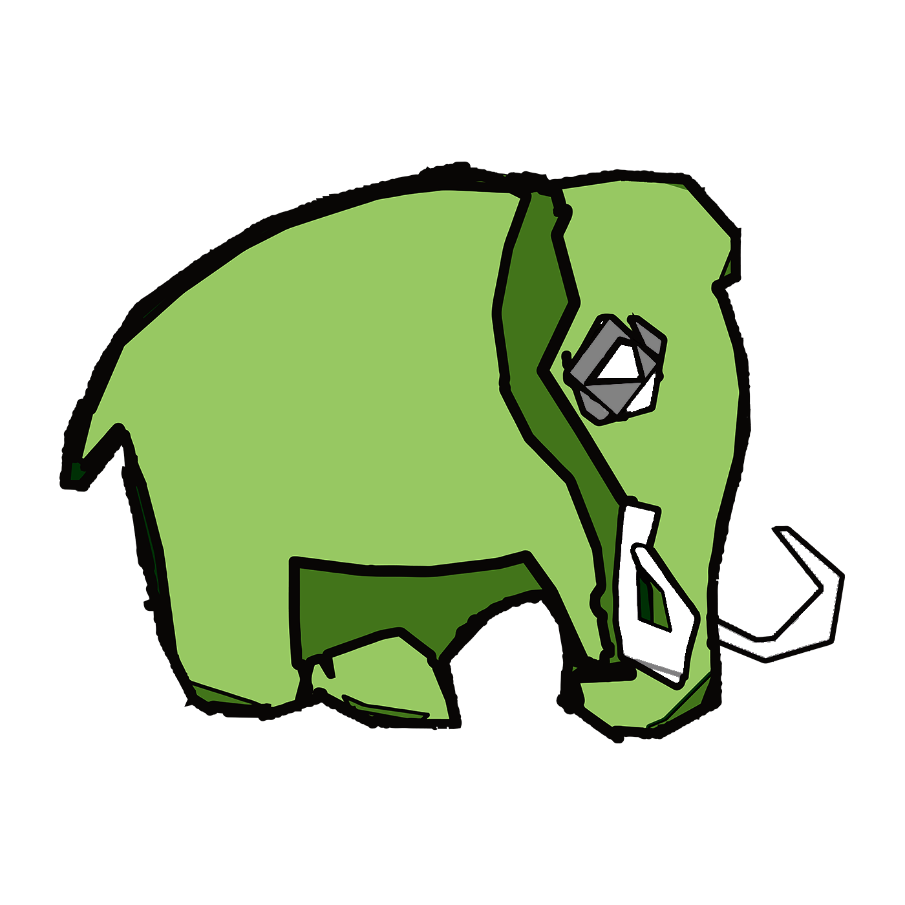

# About Mastodon and this documentation.

Mastodon is a large-scale tracking and track-editing framework for large, multi-view images, such as the ones that are typically generated in the domain Development Biology or Stem-Cell Biology or Cell Biology.

Why using Mastodon?

Modern microscopy technologies such as light sheet microscopy allows live sample *in toto* 3D imaging with high spatial and temporal resolution. 
Such images will be 3D over time, possibly multi-channels and multi-view. 
Computational analysis of these images promises new insights in cellular, developmental and stem cells biology. 
However, a single image can amount to several terabytes, and in turn, the automated or semi-automated analysis of these large images can generate a vast amount of annotations. 
The challenges of big data are then met twice: first by dealing with a very large image, and second with generating large annotations from this image. 
They will make interacting and analyzing the data especially difficult.

**Mastodon** is our effort to provide a tool that can harness these challenges. 

This pages centralize the user and developer documentation for Mastodon.
It is divided in four parts, that group sections by interest.

**A.** The first part, _Using mastodon_ contains tutorials, aimed at end-users and focused on cell tracking. 
They are meant to guide users with the Mastodon software and cover three applications of cell tracking in Mastodon:

  -   automated cell or particle tracking;
  -   manual curation and correction of tracking results;
  -   manual and semi-automatic tracking.

This also where we introduce all the user-oriented features, such as numerical features, tags, navigation facilities, data export _etc_.
If you are new to Mastodon, it is best starting with this part, and reading the tutorial in order.

**B.** The second part contains tables that summarize the main keyboard shortcuts of Mastodon.
They are put in a separate section to facilitate browsing to them quickly.

**C.** The third part is aimed at developers, that want to extend Mastodon.
Mastodon, like [TrackMate](https://imagej.net/plugins/trackmate/), is a software platform meant to be extended by you so that new features and algorithms can be added to it in a relatively simpler manner. This part detail the plugin interface of Mastodon and the discovery mechanism.

**D.** The last part is made of technical information that serve as a reference for the specificities of algorithms and features currently implemented in Mastodon.
