# Getting started with Mastodon. Automated tracking. 

This tutorial is the starting point for new Mastodon users. It will walk
you through basic operations in Mastodon, opening a dataset and creating
a Mastodon project, automatically detect cells and link them, and show
you how to use the main views of Mastodon. We don't go into details, and
will revisit the features we survey here later.

## The image data.

### Exporting your image to file format.

Mastodon uses (BDV) files as input images. You need to prepare your
images so that they can be opened in the [BigDataViewer](https://imagej.net/plugins/bdv/).

BDV files are used more and more by several software projects in the Fiji ecosystem and beyond. This tutorial focuses on Mastodon not on BDV, however we will take a very small detour to explain what makes it fit and how to turn your images into this format. 
If you know already, you can skip this part, because we simply recapitulate what is being
explained in the [original BDV publication](https://www.nature.com/articles/nmeth.3392).

For this tutorial we will use a ready-made dataset, in the adequate format, but it is a good idea to know how to export or create an image in such a format. We lazily rely on the excellent documentation and point directly to the instructions to prepare your images, depending on whether

- they are [opened as an ImageJ stack](https://imagej.net/plugins/bdv/#exporting-from-imagej-stacks), or
- they come from a [SPIM processing pipeline](https://imagej.net/plugins/bdv/#integration-with-fijis-spimage-processing-tools), or
- they come from the [BigStitcher](https://imagej.net/plugins/bigstitcher/index) plugin, _etc_.

Once you have prepared your images for opening in the , you should have a `.xml` file and a possibly very large `.h5` file on your computer. 
The `.xml` file must be the output of the data preparation. It should start with the following lines:

``` xml
<?xml version="1.0" encoding="UTF-8"?>
<SpimData version="0.2">
  <BasePath type="relative">.</BasePath>
  <SequenceDescription>
    <ImageLoader format="bdv.hdf5">
      <hdf5 type="relative">datasethdf5.h5</hdf5>
...
```

### Key advantages of the file format. 

The BDV file format solves mainly two challenges in image visualization and analysis, that arise with modern microscopy, namely:

-   Modern microscopes can generate images that are very large in size. Much larger that what can be fitted in RAM, even with the increase in computer power. It is now common to find single movies acquired on SPIM microscopes that are several TBs in size. Computers with several TBs of RAM are not so common.

-   Multiple views of the same sample can be acquired, and they need to be visualized in the same viewer. The first use case is also the multi-view images generated by SPIM microscopes, but we can also think of correlative light-electron microscopy.

If we focus on the first challenge, you see that we need to stream the image data directly from the disk, instead of fully loading it into RAM.
But at the same time, we need a tool that allows for interactive browsing of the data. The view must be responsive to the user input, and not block when it has to load the data from the file. 
The BDV file format offers a clever file format design that does this, coupled to a specialized viewer.
The image data are stored in small chunks corresponding to a neighborhood. As the viewer shows a slice through the image, the required chunks are loaded on demand and cached. All the chunks are organized in a HDF5 file, which is like a [file-system in a file](https://en.wikipedia.org/wiki/Hierarchical_Data_Format), and accessing single chunks is fast with current computer hardware.
On top of this, the image is also stored as a [multi-scale pyramid](https://en.wikipedia.org/wiki/Pyramid_(image_processing)), to speed-up zooming and unzooming.
The BDV display component exploits this file format in a clever way, and ensures that the view still answers to user interactions (mouse pan, zoom, clicks ) even if the chunks are not fully loaded.

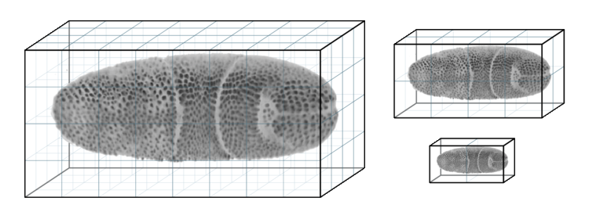
<figcaption><i>Illustration of the BDV file format storage strategy. The image is stored over several resolution levels (multi-scale pyramid) and in chunks.</i></figcaption>


There are several implementations of this strategy, for instance in
[Imaris](https://imaris.oxinst.com/support/imaris-file-format) and with the new file format [N5](https://github.com/saalfeldlab/n5) proposed by the Saalfeld
lab. Some of them are inter-compatible. We will pick the BDV file format
all along this document. The has proved its value and impact on our
field. For instance our previous work on cell lineaging in large images, [MaMuT](https://imagej.net/plugins/mamut/), is based on BDV.

### The tutorial dataset.

Mastodon was created specially because we needed to harness very big, multi-view images. 
We wanted to generate comprehensive lineages and follow a large number of cells over a very long time. 
This accumulation of inflated words is tied to the very large - in objective disk space occupation - images we deal with using modern microscopy tools. 
Such datasets might not be optimal for a first contact with Mastodon. 
So just for this tutorial we will use a smaller dataset. 
It is a small region cut into a movie following the development of a drosophila embryo, acquired by William Lemon in Patrick Keller lab (HHMI, Janelia Farm).
This was created from the example dataset released with the [TGMM software](https://www.nature.com/articles/nmeth.3036).
You can find it on Zenodo hhere:
[](https://doi.org/10.5281/zenodo.3336346)

It is a zip file that contains 3 files:

``` sh
    14M  datasethdf5.h5
   2.7K  datasethdf5.settings.xml
   8.7K  datasethdf5.xml
```

The `.h5` file is the HDF5 file mentioned above, that contains the image data itself.
The `datasethdf5.xml` is a text file following the XML convention, specific to the BDV file format, that contains information about the the image data and metadata.
When we want to open a BDV file, we point the reader to this file. 
The `datasethdf5.settings.xml` is an optional file that stores user display parameters, such as channel colors, min and max display value, as well as bookmarks in the data. 
We refer you to the [BDV documentation](https://imagej.net/plugins/bdv/#loading-and-saving-settings) about this file.
Mastodon uses this settings file to store that same information.

If you open this data in the (in Fiji in the menu), you should see something like in the figurebelow.
There is about 70 cells in each of the 30 time-points, arranged in a layer at the top of the sample. 
The deeper part of the sample (low Z coordinates) has some hazy, diffuse signal from which we cannot individualize cells. 
As time progresses, the cells move towards the middle part and bottom (high Y coordinates) part of the image, and some of them move deeper in Z, initiating gastrulation.

The goal of this short tutorial is to track all these cells in Mastodon.

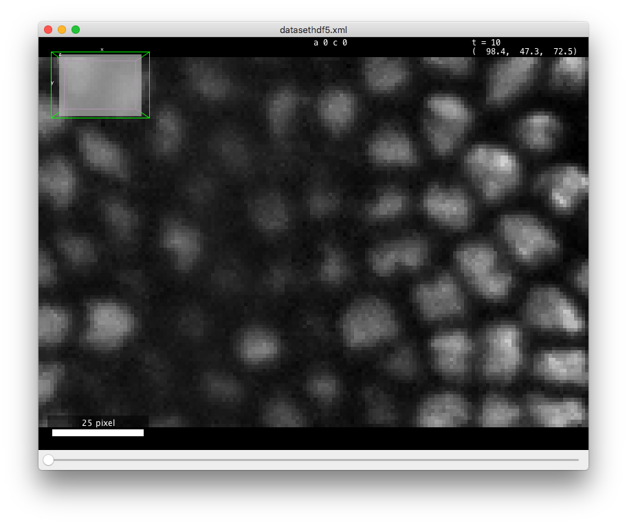{width="300px"}
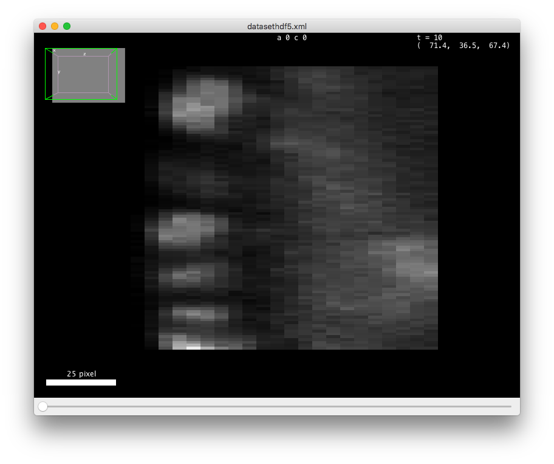{width="300px"}
<figcaption><i>The tutorial dataset opened in the Fiji BigDataViewer , seen along XY (left) and XZ (right).</i></figcaption>


## Getting Mastodon.

As of today, Mastodon is available as a beta. 
We are still working on adding and validating features.
Nonetheless the beta has everything we need to track these cells. 
Also, Mastodon is independent of ImageJ or Fiji, it can operate as a standalone software. 
However we currently distribute it via Fiji, because the updater and the dependency management are so convenient.
So the first thing to do is to grab [Fiji](https://fiji.sc/), if you do not have it already.

Then launch the [Fiji updater](https://imagej.net/plugins/updater) and once your Fiji is up to date, click on the `Manage update site` button. 
We will add the [Mastodon update site](https://imagej.net/update-sites/following). 
You should find the `Mastodon` site in the list.

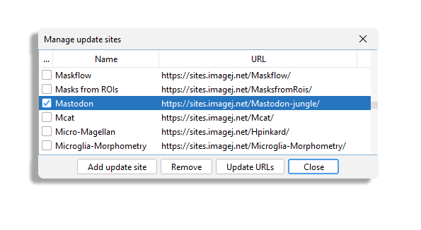

Select it, update Fiji and restart it.
After restarting, you should find the command _Plugins > Mastodon_ at the bottom of the _Plugins_ menu.


## Creating a new Mastodon project.

After launching the command, this Mastodon launcher appears.

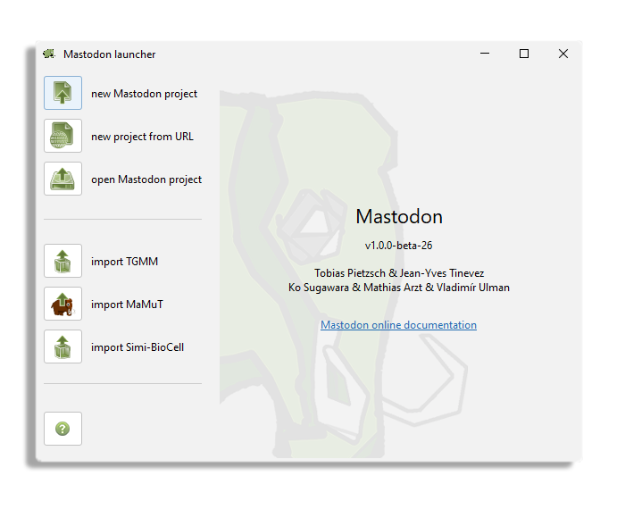{width="50%" align="center"}

In our case, we want to create a new project from an existing BDV file. 
Click on the `new Mastodon project` and make sure the `Browse to a BDV file pair (xml/h5 pair)` option is selected.
Use the `Browse` button to browse to the XML file location.

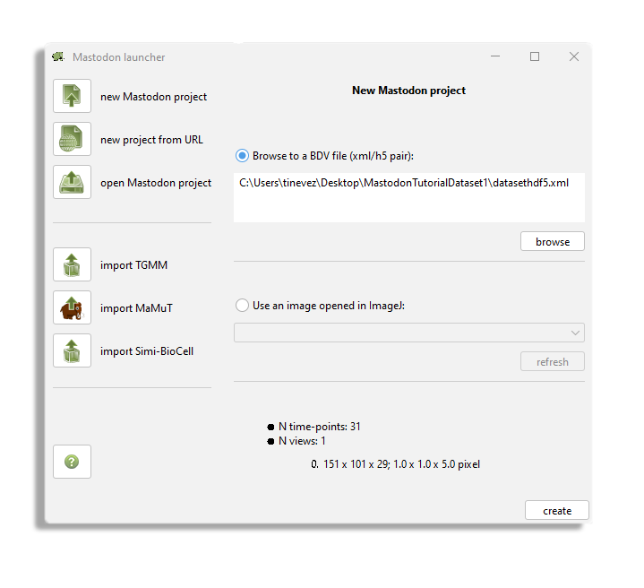

Then click the `create` button.
You should now see the Mastodon main window, that is used to control the project.

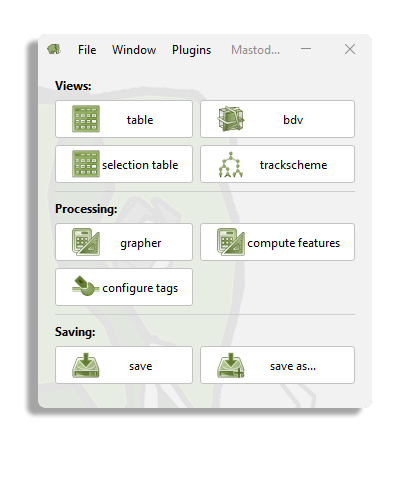{width="50%" align="center"}

Click on the `bdv` button. 
If a BDV window appears, everything is right.

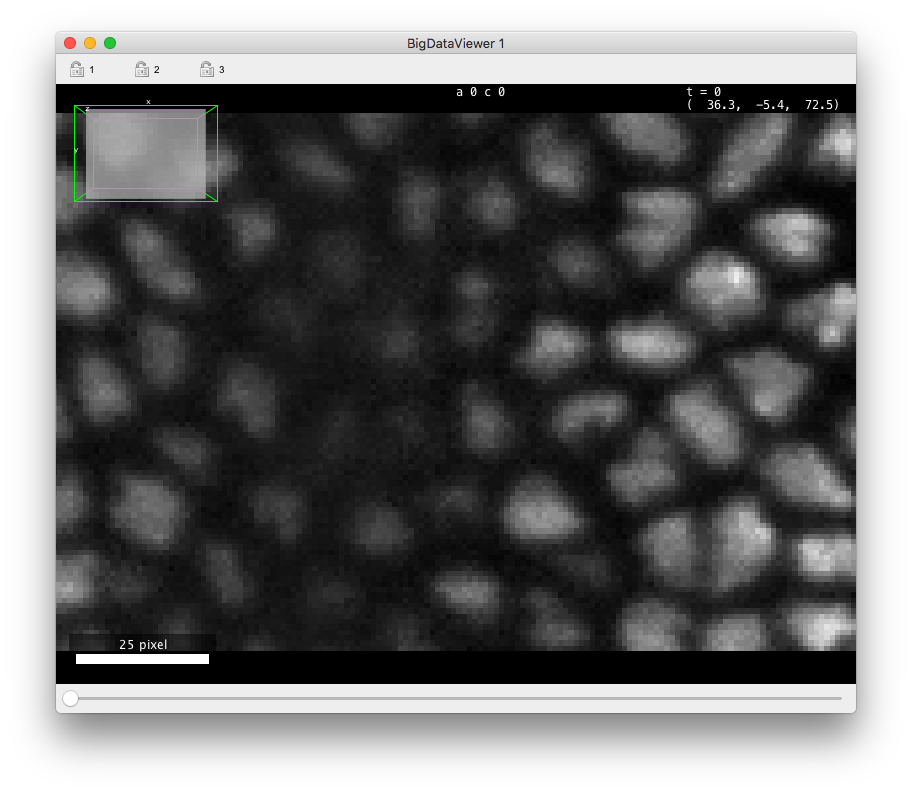{width="50%" align="center"}

It is almost a regular BDV window and if you already know who to use it and the key bindings you should find your marks quickly. 
The BDV view displays a *slice* of the image through arbitrary orientation. 
Below we give the commands and key-bindings for navigation in a Mastodon-BDV window. 
They are indeed close to what is found in the standard but some changes.
**Please note:** You can reconfigure almost everything in Mastodon, as we will see later, including key-bindings. 
In this tutorial and the next ones, the key-bindings we present are for the `Default`
configuration. 
In the [BDV navigation shortcuts](../partB/table_bdv_navigation_keys.md) table you will find the key bindings to navigate through the image data.

Now you want to save the project. 
Go back to the main window, and click on the XXX button. 
This will create a single file, called for instance `drosophila_crop.mastodon` file. 
This file is actually a zip file that contains the tracks and *links* to the image data. 
The image data is kept separate from the Mastodon file, which allows for using it with another software, independently. 
So if you want to transfer or move a full Mastodon project, you need to take the `.mastodon` file and all the `.xml` and `.h5` files from the dataset.

Next time you want to open this project, just click on the button and point the file browser to the `.mastodon` file. 
The image data will be loaded along with the lineages.


## Detecting cells.

We want to track automatically all the cells in this dataset, and the first step is therefore to detect them.
Mastodon ships a wizard to perform cell detection. 
It is very much inspired by the [TrackMate](https://imagej.net/plugins/trackmate/index) GUI, and if you know this software you will find your marks here. 
Also, the basic algorithms are very close to what was in TrackMate, but they have been heavily optimized for Mastodon.

Mastodon windows have their own menus.
The detection wizard can be launched from the _Plugins > Tracking > Detection..._ menu item. You should have a window like the one depicted below:

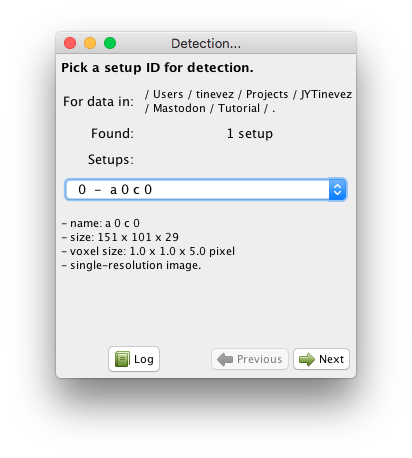{width="50%" align="center"}

Like for TrackMate, the automated tracking user interface uses *wizards*
to enter parameters, select algorithms, *etc.* 
You can navigate back and forth with the and buttons.
The button will bring an independent panel where all the activity in the wizard are logged as text.

This first panel allows for selecting the target *source* on which the detection will be run. 
Since we use the for images, a channel or a view is stored and displayed as a source. 
A source can have multiple resolutions stored, as explain above, but for the data used in this tutorial this is not the case.
The sources are nicknamed 'setups' in this panel. 
They are numbered from 0 and can be selected from the drop-down list.
Below the list we try to display the metadata we could retrieve from the file.
Just pick the first and only channel, and click `Next`.

You can now choose to operate only on a rectangular ROI in the image. 
If you check the `Process only a ROI` button, new controls appear in the panel, and a ROI is drawn into an open BDV view (a new one is created if one is not opened). 
The ROI is painted as a wire-frame box, green for vertices that point towards the camera from the displayed slice, and purple for vertices that points away from the camera, below the displayed slice.
The intersection of the ROI box with the displayed slice is painted with a purple semi-transparent overlay, with a white dotted line as borders.
You can control the ROI bounds with the controls in the panel, or by directly dragging the ROI corners in the BDV view.
Time bounds can also be set this way. 
In our case we want to segment the full image over all time-points, so leave the `Process only a ROI` button unchecked.

You cannot have non-rectangular ROIs in Mastodon. 
Nonetheless they are super useful as is. 
You can for instance combine several detection steps using different parameters in different region of your image. 
Or different time interval.

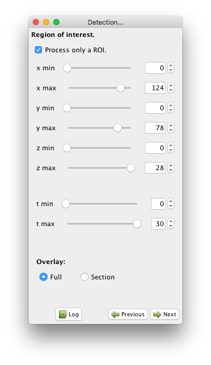{width="30%"}
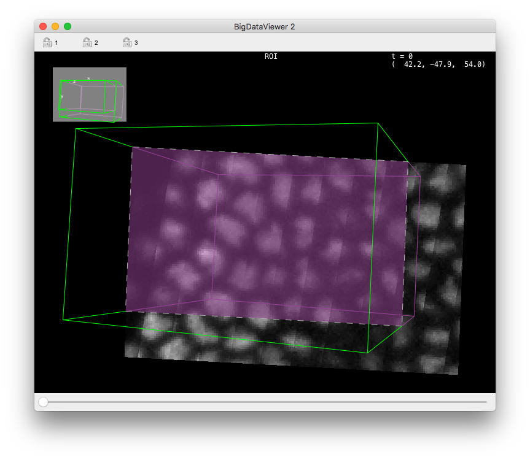{width="60%"}

The next panel lets you choose the detector you want to use. 
In Mastodon, three detectors are available.
Right now, we will use the default one, the `DoG detector`, which should be good enough for most cases.
DoG means 'difference-of-Gaussians'. 
It is an efficient approximation of the LoG ('Laplacian of Gaussian') filter, and there is also a detector in Mastodon based on the latter.

These detectors excel at finding roundish structures in the image that are bright over a dark background.
The structures must have a shape somewhat close to a sphere, but they can accommodate a lot of variability.
As a rule of thumb, if you can define rough estimate of the radius of these structures, they are eligible to be picked up by our detectors.
This also implies that in Mastodon, we cannot segment complex shapes, or object labeled by their contour (*e.g.* cell membranes), or even exploit these shapes to have an accurate measurements of the volume.
This is an important limitation of Mastodon.

For now, select the `DoG detector` and click `Next`.

Here is briefly how it works. 
The LoG detector, and its approximation the DoG detector, is the best detector for blob-like particles in the presence of noise (See [Sage et al, 2005](https://ieeexplore.ieee.org/abstract/document/1495509).
It is based on applying a Laplacian of Gaussian (LoG) filter on the image and looking for local maxima. 
The result is obtained by summing the second order spatial derivatives of the gaussian- filtered image, and normalizing for scale.
Local maxima in the filtered image yields spot detections. 
Each detected spot is assigned a **quality** value, that is obtained by taking the intensity value in the LoG filtered image at the location of the spot. 
So by properties of the LoG filter, this quality value is larger for :

-   bright spots;
-   spots which diameter is close to the specified diameter.

The DoG detector requires only two parameters: the estimated diameter of the object we want to detect, and a threshold on the quality value, that will help separating spurious detections from real ones. 
The panel you are presented let you specify these parameters, and preview the
resulting detection. 
Try with 10 pixels for `Estimated diameter` and 0 for the `Quality threshold`.
The click on the `Preview` button. 
A preview panel should open shortly, showing detection results on the current frame:

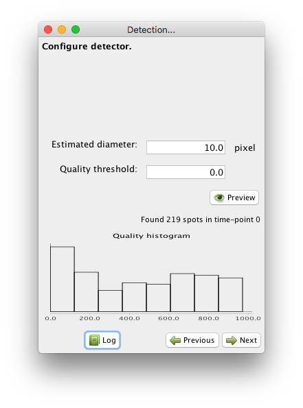{width="50%"} 
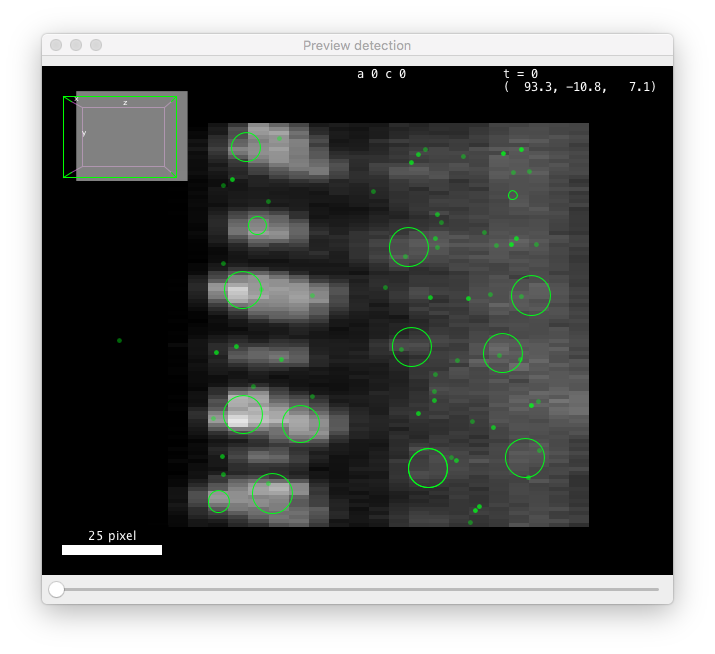{width="40%"}

These values are close to be good but not quite.
You can see that the diameter value is too small to properly grasps the elongated shape of the cells along Z (the BDV view on the left panel above is rotated to show a YZ
plane).
Also the threshold value is too low, and some spurious detections are found below the epithelium.
These spots have a low quality, that manifests as a peak at low value in the quality histogram displayed on the configuration panel. 
From the shape of the histogram, we can infer that a threshold value around 100 should work.
However we also need to change the diameter parameter, which will change the range of quality values. 
After trial and errors, values around 15 pixels for the diameter and 400 for the threshold seem to work.

Note that you can run the preview on any frame. You just have to move the time slider on the preview window. 
Once you are happy with the parameters, click on the button. All the frames specified in the ROI (if any) will be processed.
In our case detection should conclude quickly and the following panel should appear:

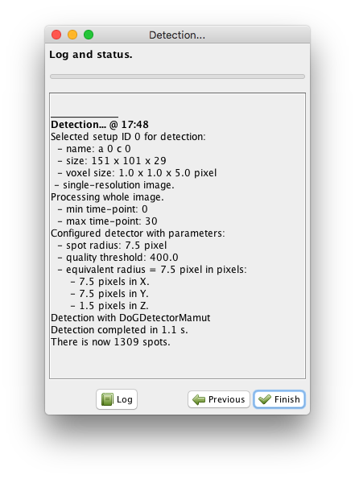{align="center"}

We now have more than 1000 cells detected and this concludes the detection step.
Click on the `Finish` button, and the wizard will disappear.


If you have complex images mixing several size of objects, or detection parameters that work for one part of the movie but not for another one, you could restart a new detection now, selecting for instance other parts of the movie with the ROI.
You can do this and more, but for this kind of approach, the **Advanced DoG detector** offers more configuration capabilities, that will review later.


## Linking cells.

What we just did is the detection step.
It yields one Mastodon spot per cell, but the notion of cell identity propagated over time is missing yet.
The particle linking step just does that. 
A particle linking or tracking algorithm accepts a collection of spots, ordered by frames (time-points), and tries to link each spot to the next spot(s) in the next frame or so. 
All the spots you can reach by starting from one spot and navigating across links build a *track*, and in our case it represents one cell (or any other object) followed over time. 
In most cases there is one spot per frame for a track, meaning that that a spot has at most one incoming link (spot from previous frame) and one outgoing kink (spot in next frame). 
But some algorithms can accommodate *e.g.* dividing cells (2 outgoing links for the mother cell going to the two daughter cells) and merging events.
There is a vast literature behind tracking algorithms, and it is an active domain of Research. 
A [paper](https://www.nature.com/articles/nmeth.2808) compares implementation and list some pros and pitfalls of many of them.


### Selecting target spots for linking.

Like for the detection step, linking in Mastodon happens in a wizard.
And also like for detection, the linking algorithms currently available in Mastodon are adapted from TrackMate. 
Launch the wizard from the GUI, with the _Plugins > Tracking > Linking.. ._ menu item. 
The first panel you are shown lets you select what spots to include in linking:

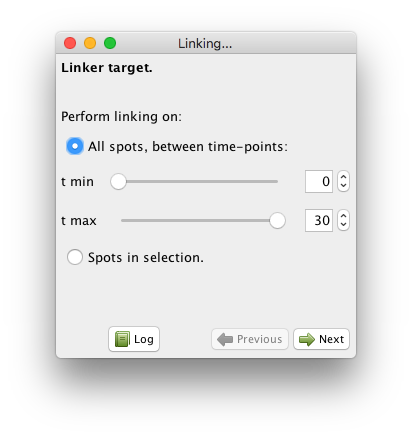{align="center"}

There are two modes:

-   Either you take all the spots between a start and and end frame. By default, all frames are selected.
-   Either you specify you want to link only the spots that are in the selection. 
This mode offers a lot of flexibility when facing complicated cases. 
It is best use along with the [selection creator](selection_creator.md), that we will describe later in this manual.

For now, just leave the parameters as they are, which will include all spots in the linking process, and click next.
You can now choose between several linking algorithms.


### Available linking algorithms in Mastodon.

In Mastodon, they fall mainly in two categories.

The first two LAP trackers are based on the **Linear Assignment Problem (LAP) framework**, first developed by [Jaqaman *et al.*](https://www.nature.com/articles/nmeth.1237), with important differences from the original paper described [elsewhere](https://imagej.net/plugins/trackmate/algorithms#main-differences-with-the-jaqaman-paper). 
We focused on this method for it gives us a lot of flexibility and it can be configured easily to handle many cases. 
You can tune it to allow splitting events, where a track splits in two, for instance following a cell that encounters mitosis. 
Merging events are handled too in the same way.
More importantly are gap-closing events, where a spot disappear for one frame (because it moves out of focus, because detection failed, ...) but the tracker can rescue missing detections and connect with reappearing spots later.

In Mastodon the LAP algorithms exists in two flavors: a simple one and a not simple one. 
There are again the same, but the simple ones propose fewer configuration options and a thus more concise configuration panel.
In short:

-   The simple one only allows to deal with gap-closing events, and prevent splitting and merging events to be detected. 
Also, the costs to link two spots are computed solely based on their respective distance.

-   The not simple one allows to detect any kind of event, so if you need to build tracks that are splitting or merging, you must go for this one. 
If you want to forbid the detection of gap-closing events, you want to use it as well.
Also, you can alter the cost calculation to disfavor the linking of spots that have very different feature values.

The third tracker is called **Linear motion Kalman linker**. 
It can deal specifically with linear motion, or particles moving with a roughly constant velocity. 
This velocity does not need to be the same for all particles.
It relies on the [Kalman filter](https://en.wikipedia.org/wiki/Kalman_filter) to predict the most probable position of a particle undergoing (quasi) constant velocity movement.


### How to pick the right linking algorithm?

The right choice of a particle linking algorithm is conditioned by the expected motion of the object you track. 
As a rule of thumb, you can make a decision following these simple rules:

-   If the objects you track are transported by an active process and have a motion for which the velocity vector changes slowly, then pick the **Linear motion Kalman linker**.
-   If the object motion is random (like in Brownian motion) or unknown, pick on the LAP linker. If the objects you track do not divide, nor merge, pick the **Simple LAP linker**.
-   If the objects divide or merge, or if you want to specify linking costs based on numerical features (like spot mean intensity), then pick the **LAP linker**.

In our case, we need the **Simple LAP linker**. 
Select it and click `Next`.


### Running the Simple LAP linker.

This linker only requires the specification of three parameters.

The first one is the `Max linking distance` during frame-to-frame linking.
This is the distance beyond which linking a spot to another one in the next frame will be forbidden. 
For instance, if you know that your objects move by at most 5 µm from one frame to the next, pick a value slightly larger, for instance 6 µm.
Distances are expressed in whatever physical units the BDV dataset specified. 
In our case it is pixels.

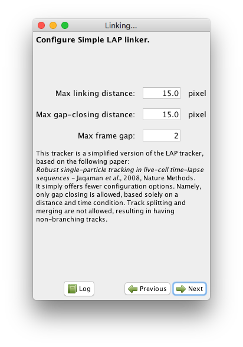{align="center"}

In practical cases, it can happen that the detection step might miss an object in some frames, then detect again later. 
These gaps will result in generating several small tracks for a single objects, which is one of the main course of spurious results when analyzing tracks. 
The simple LAP linker can bridge over missed detections. 
It does so by inspecting small tracks that results from frame-to-frame linking, and tries to connect the end of one with the beginning of another one. 
The last two parameters of the linker specifies how they are bridged. 
The `Max gap-closing distance` specifies how far can we look for candidates when we try to bridge the end of a track with the beginning of another one.
The `Max frame gap` specifies how far they can be in time. 
For instance a Max-frame-gap of 2 means that we can bridge the end of a track at frame _t_ with the beginning of a track at frame _t+2_. 
Which results of bridging over detections missed by no more than 1 frame.

In our case, the default parameters turn to work fine. 
Click `Next` and the linking will proceed.
Click on the `Finish` button to end the tracking process.
If you have a BDV window opened, it should be updated with the tracking results, like in image below.

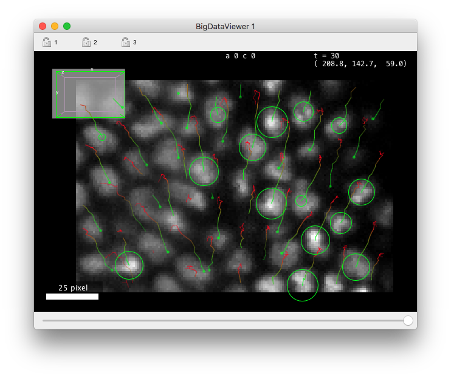{align="center"}


By default the tracks are represented by colored lines, extending backward in time. 
Points in tracks that are close to the current time-point are green and fade to ref for points that are far back in time.
When you change the Z focus, the spots are painted as circle of radius corresponding the the intersection of the sphere with the current Z-plane.
When the spot sphere does not interest with current Z-plane, it is painted as a small dots. 
The points of the track away in time that are not close to the current Z-slice are faded away. 
We will see later how to customize the display of tracks.


## Wrapping up.

This concludes our first tutorial on automated tracking with Mastodon.
To continue with the next one, save the project with the tracks you just generated.

As you can see, after creating a project from a BDV file, the process consists mainly in running in succession the two wizards, one for detection, one for particle linking.
Even if they provide fully automated tracking, Mastodon is made for interacting with the data as you generate it.
We will see in a next section how to manually edit a spot, a link or a track even at the finest granularity. 
But keep in mind that the tools we quickly surveyed can be used interactively too. 
First the wizards let you go back to change a tracking parameter and check how the results are improved or not. 
Second, because you can specify a region-of-interest (ROI) in the detection step, and select the spots you want to track in the linking step, several runs of these wizard can be combined on different parts of the same image, to accommodate *e.g.* for changing image quality over time, or cell shape over time.
Mastodon aims at being the workbench for tracking that will get you to results, accommodating a wide range of use cases.
