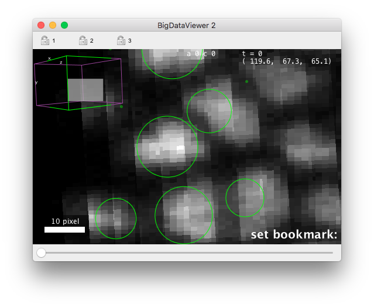
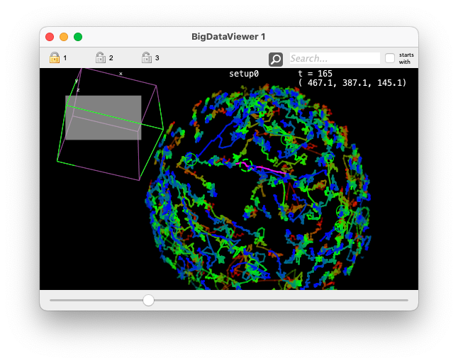
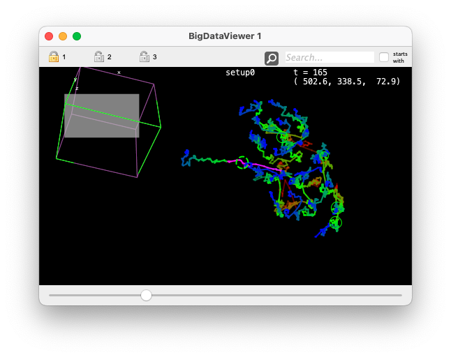
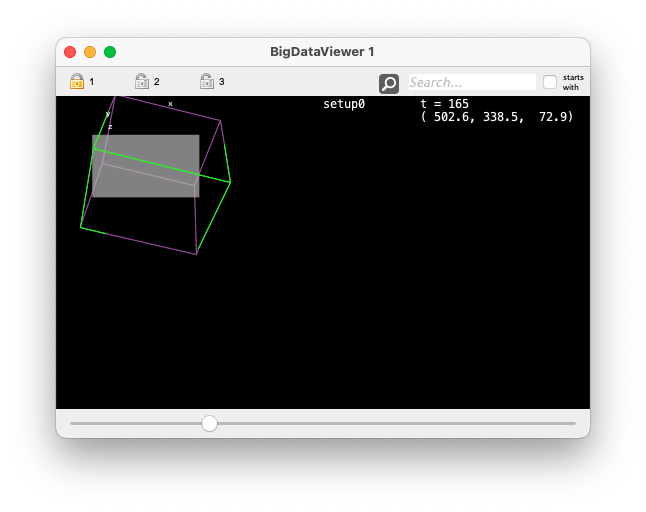
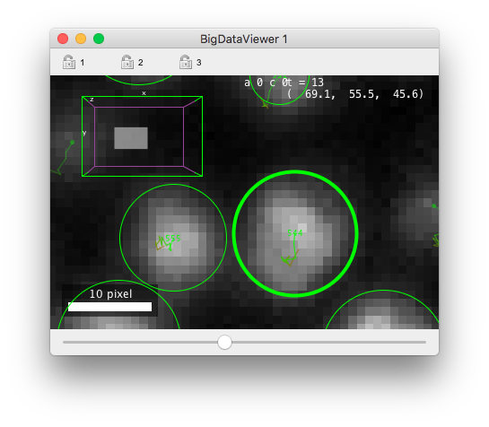
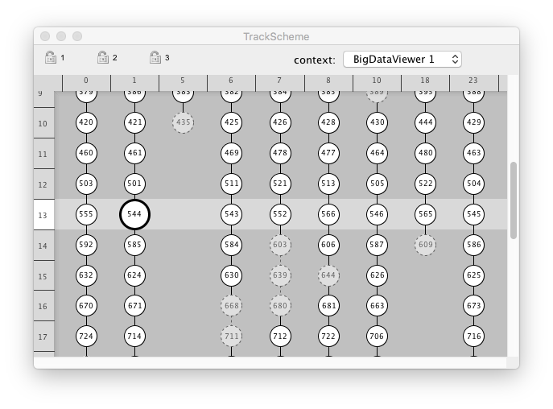
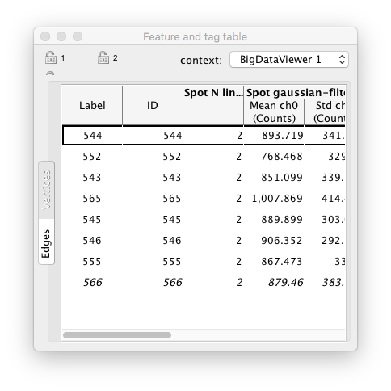

# Inspecting large datasets.

In the previous chapter we have seen how to edit single spots and links in Mastodon, what can be called point-wise editing. 
As we said before, the goal of Mastodon is to let you harness very large images, for which the number of annotations can be very large too. 
It can be very easy to get lost within such large images and loose track of where we are within the sample image and what cell we follow. 
So we have added several features that are made especially to get your bearings in large datasets.
More than anything, these features are about giving visual cues that ease orientation, and exploit events and signal that would help a human brain get a sense of orientation. 
We took some inspiration from video-games, that are very good at communicating condensed and synthetic information to the player (but only for a limited part; there is no screenshake when you delete a spot).

## Bookmarks in the BDV views.

The  [BigDataViewer](https://imagej.net/plugins/bdv/) (BDV) is the image component of Mastodon and is meant to deal with very large images.
It offers interactive and responsive user interaction, and to achieve this without any hardware acceleration, it resorts to only displaying a 2D slice through the data. 
This 2D slice can be arbitrarily positioned and oriented. 
When it comes to annotating a 3D image, using a 2D slice is a good approach. 
A full 3D view might actually hinders proper and efficient annotation of the data with a flat 2D screen and a mouse.
The 3D view leads to ambiguities about the depth positioning of your cursor, and the image data that stands between the camera eye and the plan of interest may hide it. 
Parenthetically, these issues with interacting with 3D data are best solved with virtual reality devices, but Mastodon is not a tool that exploit them. 
The 2D view offer clarity but conversely does not offer a great feeling of the context. 

However to facilitate orienting yourself, or retrieving a key point in the data, you can register bookmarks in the BDV views. 
The bookmarks were already implemented in the tool itself before its use in Mastodon.
They let you store a position and orientation in space as bookmarks. 
You can later call them again and retrieve said position.

-   First move to the position and orientation you want to store in a bookmark.
-   Then press `B`. 
You should see a message prompting you to press another key (see the image below).
-   Pick one and press it. 
This key will be used as a tag for this bookmark.
-   To later retrieve the position and orientation of this bookmark, press `B` then the bookmark's key. 
The view should animate and restore the stored position and time-point.
-  `O` does the same things, but only restore the bookmark orientation, not its position.

You can have many bookmarks, all identified by the key you press after the bookmark command. 
Bookmarks are saved with the BDV settings file that also saves the channel color and display range. 
You can save such a file with the or the key.
The settings file is loaded when a new BDV window is displayed.

## View modes in BDV.

The BDV views has also four different visibility modes that help making sense of tracks of interest. 
You can cycle between them by pressing the `V` key with a BDV active.
These four views are:

**All**. 
In this mode (the default), all the tracks are visible.
It follows the display configuration you set with the render settings however.

**Track of focused vertex**.
In this mode, only the track (_e.g._ the whole lineage of a cell) of the currently focused spot is displayed.

This visibility mode is particularly useful in conjunction with a TrackScheme window, where you would move the focus across different lineages with the keyboard. 
Comparing the image above with the image of the previous mode (movie and annotation by Mette Handberg-Thorsager and colleagues in the Tomancak lab), you can see with this visibility mode that the lineage of a progenitor tends to colonize only one side of the embryo.

** Selection only.**
In this mode, only the content of the current selection is displayed.

This visibility mode is best used along with the _Selection creator_, the we describe later, and that lets you set the selection based on various criteria.

**None.**
In this mode, the tracks are not displayed. 

## Linking several views together.

You can generate as many views as you want in Mastodon, and you can link several of them via the lock system. 
This is a good way to improve the perception of context, by linking several views that display for instance a close-up view of the data and another view displaying a bird-eye view of it.
We already presented this feature in the [previous tutorial](manual_editing.md#synchronizing-several-views-together). 
The figure of this section shows an example of a view configuration with three views in sync, showing each a different level of desired information. 
We direct you there for details on how to use the lock system.

## In TrackScheme everything is animated.

If you went through the previous tutorial, you probably noticed that editing events are associated with animations in TrackScheme. 
For instance, if you delete a link in the middle of a track, the 'bottom' part of the track will move to the left side of TrackScheme, in a quick animation. 
If you undo the deletion, the branch will move back to its original place the same way. 
Deleting a spot makes it fade rather than disappear.
These animations are more than a toy.
Something we learned that hard way with [MaMuT](https://imagej.net/plugins/mamut/index) is that point-wise editing the data can completely confuse and disorient the user. 
A single link deletion will generate a big rearrangement in the track hierarchy, and therefore will change the view a lot.
Without any subtle cues to the user, these changes will disorient them quickly.
Animating the editing events is a great way to hint them about what happens to the data modify in a user-friendly way.

We also added some fluidity and inertia in navigation. 
In the [TrackMate](https://imagej.net/plugins/trackmate/) and [MaMuT](https://imagej.net/plugins/mamut/index) version of TrackScheme, panning and zooming were done in discrete discontinuous steps, that would also lead to confusion.
In Mastodon, moving and zooming are done continuously.
There is even some inertia again to emulate interacting with a tangible panel.

## Spatial context in TrackScheme.

There are situations where the density of cells displayed in is so high that even at high zoom level this view is barely useful. 
The hierarchical arrangement of tracks in is handy to grasp how tracks behave over time.
But since it eliminates spatial information, the neighbors of a track do not bring information to it.

The spatial context in reconciles spatial information with the hierarchical layout.
In views, the toolbar has a `context` list box, from which you can select between `full graph` and the names of all the BDV views currently opened (typically `BigDataViewer 1`, _etc_).
When `full graph` is selected, the full lineage data is shown in TrackScheme. 
This is the classic view.
If you pick an item corresponding to an opened BDV view, then this view will only display the lineages of the cells currently displayed in the target BDV view.
And the view will be updated (and animated) as you pan, move in Z, zoom or unzoom the BDV view.

<figure markdown>
   
   
   
  <figcaption><i>Context in Mastodon. The context displayed in TrackScheme (center) and the table (right, detailed in a following tutorial) is determined by what is currently displayed in the BDV window (left). 
The content displayed in and the table is updated live as the view in the BDV window is changed by the user. </i></figcaption>
</figure> 
 

Try it now with the data from the previous tutorial. 
Open a BDV view and a view. In the view, select the `BigDataViewer 1` item (it might not be 1 in your case). 
Then in the BDV view, zoom so that almost only one cell is displayed.
The view should display considerably fewer tracks. 
As you unzoom, some lineages will appear in TrackScheme. 
You will probably see that some lineages appear in gray, with dashed lines. 
They are called "ghost" lineages: 
These are the lineages of cells that are not within the BDV view at the time-point currently displayed, but that will enter this view later or earlier in time.
The context feature is immensely useful when studying tissue development or coordinated cells movement.
