# Numerical features and tags. The table view.

Mastodon is a tracking and lineaging tool. 
Its output is a collection of tracks, and the analysis of these tracks to yield statistics on velocity, displacement is carried out in another software package such as MATLAB or Python. 
Nonetheless you will find in Mastodon tools to compute *numerical features* on data item. 
Numerical features are numbers that can be calculated on spots, links and tracks of the data.
For instance there are feature for the number of links that touch a spot, or the displacement of a link or the number of spots in a track.
You can find them within Mastodon because it is convenient, but also because they are very useful for the interactive exploration of your data.
Coupled with feature-based coloring, the display and sorting of values in the table view and the selection creator tool, they can considerably accelerate and facilitate making sense of the data.

Numerical features are numbers that classically relate to a physical quantity.
When we need to *categorize* items, we rely on *tags*. 
We describe them just below.
This chapter will also show you how to compute numerical features and create a coloring view from the feature values and tags.
Doing so, we will introduce the third kind of data view in Mastodon: the data tables.

## Tags and tag-sets.

As we said above, every-time you need to categorize certain data items, or need to visualize categories, you should rely on tags. 
Let's suppose that you are investigating the trajectories of cells in a developing embryo from an early stage to a stage where the embryo is polarized.
Some cells will migrate to the anterior part, some others to the posterior part, _etc_. 
You might want to tag cell tracks with the `Anterior` or `Posterior` tag, to investigate where do these cell come from in the early embryo. 
Or let's say that you are curating the results of the automated tracking on a large images. 
The tracking results might have some inaccuracies, and you want to correct them for important tracks.
Because there is a lot of tracks, you share the workload with some colleagues.
You work asynchronously with them, editing the Mastodon file one after another.
Doing so, you can use tags in Mastodon to mark some tracks as reviewed by you. 
Your colleagues will use a tag for themselves, to ensure that no two scientists are reviewing the same track twice.
All the cells that are not tagged in this categorisation are still waiting to be reviewed.

In Mastodon, a categorization corresponds to a **tag-set**. 
A tag-set defines a property that can have a reasonable number of discrete values, or **tags**. 
In the first of the two examples above, `Location` would be a tag-set to specify the location of cells. 
`Anterior` and `Posterior` would be two tags belonging to the `Location` tag-set. 
In the second example, `Reviewed by` would be a tag-set, and `Mette`, `Pavel`, `Tobias` and `Jean-Yves` would be 4 tags of this tag-set.

You can assign tags to spots and links. 
To assign a tag to a whole track, you have to assign this tag to all the spots and links of this track.
One data item (a spot or a ling) can have 1 or 0 tags per existing tag-set. 
But they can be categorized by as many tag-sets as there is.
For instance, a spot can have the tag `Anterior` in the `Location` tag-set, and the tag `Pavel` in the `Reviewed by` tag-set. 
Or it can be not tagged in the `Reviewed by` tag-set. 
But it cannot have both the tag `Mette` and the tag `Tobias` because they belong to the same tag-set.
Each tag-set works independently, and clearing a tag-set does not affect the others even for one data item. 
Now that we set things straight, let's see how to create tag-sets. 
We will base the demonstration in this chapter on the data we generated in the [first tutorial](getting_started.md).

### Creating tag-sets.

On the main Mastodon window, there is a `configure tags` button . 
Pressing it opens the tag-set dialog.
Right now, it appears as an empty table made of two columns.
This is where you enter tag-sets and tags.

<figure markdown>
   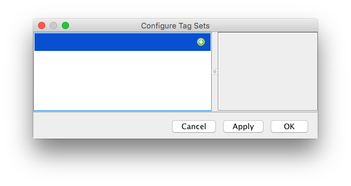{width="45%"}
   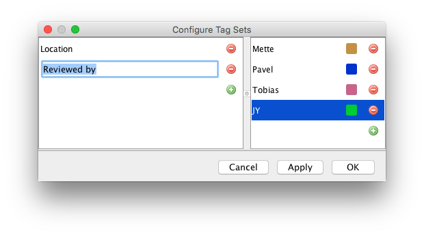{width="45%"}
  <figcaption><i>Creating tag-sets and tags. 1. The empty tag-set dialog. 2. After adding two tag-sets and six tags. </i></figcaption>
</figure> 
 

Press the green `+` button on the left column to create a new tag-set. 
A default name is shown for the tag-set, that you can edit. 
You can also directly press the `Enter` key to immediately start editing the new tag-set. 
Let's say we want to create the location tag we talked about before. 
Type `Location` in the text field.
An empty line followed by a green `+` button should appear on the right column.
This is where you will enter the tags of this tag-set. 
Click on this button, or press the `↹` key followed by the `Enter` key to create a new tag.
For instance, the `Anterior` tag. 
Note that a tag is only made of a label (the text) and a color.
The color will be used in Mastodon views.
Create a second tag for the same tag-set called `Posterior`. 
Pick the color as you like.
Now try to create another tag-set called `Reviewed by` and create some tags in this tag-set.
The tag-set dialog is normally fully navigable with the cursor keys, so that you can enter tags quickly if you have a lot of them.
You can create new tag-set or new tags with the `Enter` key, and delete them either with the `⌦` key or by pressing the red `-` button.

When you are finished, press the `OK` button.

### Assigning tags to data items. 

Tags are set via the selection tool, presented in the [second tutorial](manual_editing.md#the-selection) . 
Once you have some spots and links in the selection, you can assign a tag to it via the menu. 
The menu content will be updated with the tag-sets and tags you defined in the tag-set dialog, described above.
This will work in any Mastodon views, BDV or TrackScheme.

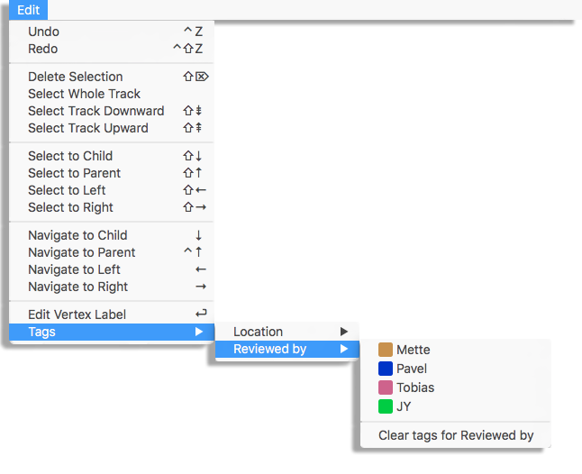

TrackScheme ships a second way to set tags quickly from the keyboard. 
After selecting the spots and links of interest, press the key. 
A floating menu should appear on the left part of the view panel.
There is a bit of naming clash in the floating menu.
Here, tag-sets are called *tags* and tags are called *labels*. 
Select the desired tag-set with the `1`, `2`, .. keys. 
The menu now shows the tags defined within this tag-set, that you can select the same way. 
Note that there is a way to remove all the tags over all the tag-sets on the selection by pressing on the first menu, or just the tags of the selected tag-set by pressing on the second menu.

<figure markdown>
   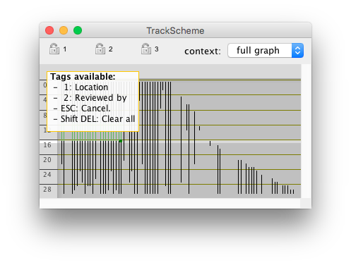
   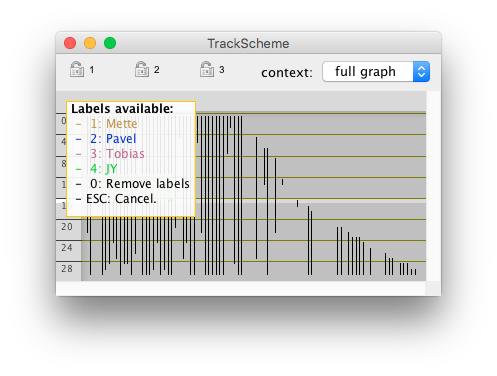
  <figcaption><i>Assigning tags in . After pressing the `Y` key this floating menu is shown, that can be navigated with the digit keys. </i></figcaption>
</figure> 
 

### Coloring views by tag-sets.

The tags we just defined and assigned can be used in with the views, to highlight the items that are tagged. 
In the _View > Coloring_ menu of any view in Mastodon, you will find a sub-menu updated with the tag-sets you created among other choices.
By default, newly created views are colored with the coloring mode, which simply colors all the spots and links the same way, taking colors from display settings. 
If you select a mode corresponding to a tag-set, tagged spots and links will appear painted with the color you chose for the tags of this tag-set . 
This is very handy to mark some locations in the image or highlight interesting tracks in the data.
Later we will see that tags can be used to retrieve specific items for further processing. 
Finally, in there is an option to show a legend of the current coloring mode. 
You can toggle it on or off and set the location of this legend in the _View > Colorbar_ menu.

## Numerical features.

Numerical features are values that are calculated from the data. 
For instance the mean intensity within a spot, or the displacement along a link.
They are very generic: the main restrictions is that there must be a data item (a spot or a link) per feature value. 
But the feature itself can be scalar, non-scalar, real, integer, a string, a vector, _etc_. 
They are *labile*. 
Because they are defined for a data item, they will become invalid as soon as the data item changes. 
Think of what happens to the spot mean intensity if the spot is moved over the image for instance.
Because we want to accommodate extensibility and large data, we have to use a special system that we describe below.

### Feature computation.

Some numerical feature values are calculated by **feature computers**.
Feature computers are actually specialized Mastodon plugins, made so that it is easy for a 3rd party (you) to implement their own features in Mastodon.
We explain you to write your own feature computer in the second part of this documentation, dedicated to technical information.

Because feature computation can take very long on large images, you have to trigger it manually.
On Mastodon main window, you can find a button `compute features`.
Pressing it will show the feature computation dialog.
The feature computers are listed on the left panel.
Clicking on the computer name displays some information about the feature they compute in the right panel. 
Note that they are named 'features' on this panel, but they are in reality the feature computers. 
For instance if you click on the `Spot intensity`, you will see in the information panel that this computer generates a feature for the mean intensity, median intensity, _etc_.
Note also that they can have dependencies. 
For instance, the `Link velocity` feature computer depends on the `Link displacement` feature to be present at the time of computation.

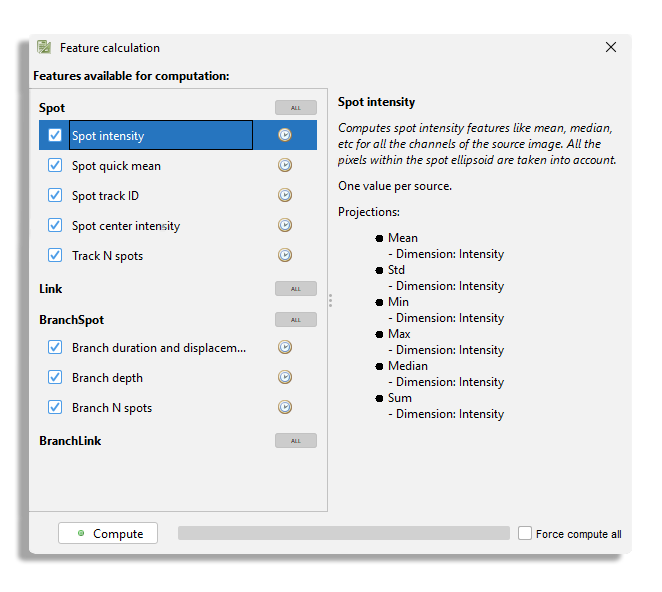

The check-box on the left of each feature computer name triggers whether they will be part of the next feature computation. 
Press the `Compute` button to trigger computation of features.

Once the computation of all the features is complete, all the small clock icons that were shown right to the feature computer names now turned to a green dot.
This is how we keep track of the validity of the feature values.
Since the feature computation is triggered manually, and that a feature value might invalidated if the data changes (new spots added, removed, moved, changed the radius, added or removed some links), this icon serves as a signal for feature value de-synchronization. 
If the icon is shows as a clock , it means that the data changed since the last feature computation, and that the feature values are out of sync.
If is shows a green dot, then the data did not change since last computation, and the feature values are sure to be valid. 
This is very important for proper interpretation of the data, and you will have to show the computation dialog often just to check the feature values validity.
By the way, you can check now how the validity flag works.
While keeping the feature computation dialog open, move a spot in a BDV view.
You should see that all the green dot icons now turn to the clock icon.
Also, if you now deselect some feature computers before launching a new computation, the validity flag will not turn to the green dot icon for those feature computers.

You probably have noticed, thanks to the progress bar, that the intensity-related features are the ones that take the most time to compute.
Indeed, they require loading all of the data blocks on which there are spots.
This could rapidly become cumbersome for large datasets, if you have to recompute all of the features every-time a spot is added or edited.
Fortunately we implemented an update mechanism for feature computation.
After the first computation, which possible takes very long, only the spots that have been added or modified since the last computation are considered for computation.

Now that we have feature values computed, we would like to inspect them and export them for further analysis. 
This is the role of the table view, but before getting to it, we will make a little detour to showing how to use features to generate coloring, accelerating updates of computation and saving them to disk.

### Coloring views by numerical features.

We have seen above that tag-sets could be used to generate coloring of the data items shown in a view.
Indeed, in the _View > Coloring_ menu of each view, that tag-sets are listed and when selected, are used to assign a color to each data item.
We can do something similar with feature values, except that feature based coloring requires more input from us.

Feature color modes need to be created first, and this is done in a dedicated user interface. 
Select the _File > Preferences_ menu item in the main window or any view.
This shows the preferences dialog.
It is organized with a side-bar on the left that contains the various items that can be configured in Mastodon.
Parenthetically, you can see that you can configure the display style of the and BDV views, and the keymaps. 
But we will see this later.
In the sidebar select `Feature Color Modes`. 
The panel on the right now display the feature color mode configuration panel:

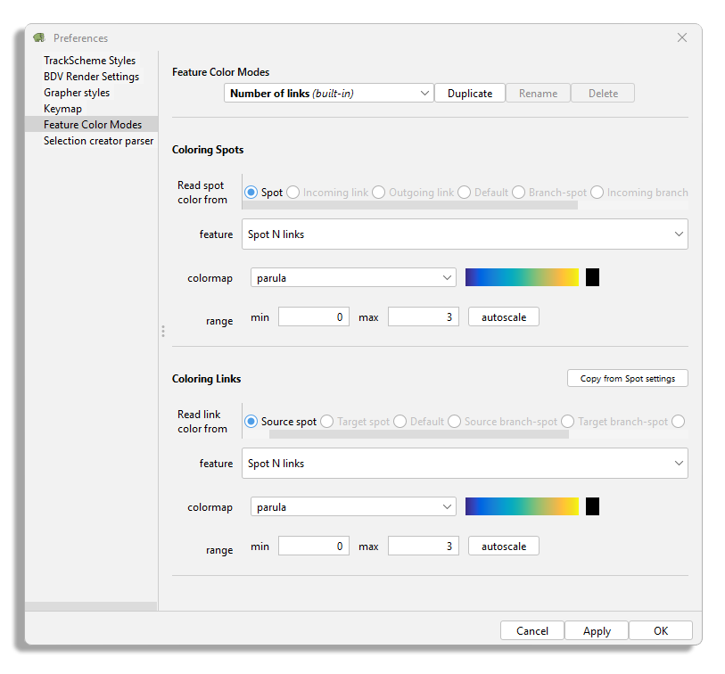

Its top line has a drop-down list that contains all the color modes already defined. 
Right now, there is only one, called **Number of links**. 
As the ***built-in*** suffix indicates, it is a built-in color modes, and it cannot be edited. 
To create a new one you must duplicate it and rename the new one.
Do so by clicking on the `Duplicate` button, then on `Rename`.
Let's create a color mode that color spots and links based on the mean intensity inside the spots, that we would call **Mean intensity**.

The rest of the configuration panel is made of two parts. 
The top part configures the spot coloring, or how we color spots. 
The bottom part configures the link coloring, or how we color links. 
In Mastodon the data is organized in a [mathematical graph](https://en.wikipedia.org/wiki/Graph_(discrete_mathematics), in which the vertices are the spots, and the edges are the links that connect spots from one frame to another, so you will sometimes find in Mastodon and in this manual the vocables vertex and edge to design a spot and a link respectively.
The vertex color mode specifies where do we take colors from. You can
choose between:

-   `Spot`, which means a spot will take its color from a feature
    value it owns.
-   `Incoming link`, which means a spot will take its color from a feature value owned by the single incoming link that targets this spot.
This is the link backward in time. If there are no such links or more than one, then the default color is used.
-   `Outgoing link` is the same thing, but for the link forward in time.
-   `Default` mode does not rely on feature values but simply uses the default color in the view.

Depending on the mode you chose, the content of the drop-down list below, called `Spot feature`, will change to reflect either the list of spot features or the link features. 
Select **Spot** as a color mode and **Spot intensity** as feature. 
Two new drop-down list appear on the right of the feature list.
One contains the list of projections in the feature and the second one contains the list of channels in the dataset.

We need to explain a bit what are **feature projections**. 
We said above that a feature could be roughly anything numerical, and was not necessarily a scalar.
It could be a vector, a tensor, a complex number, _etc_.
However to be usable and useful in Mastodon, features are required to expose a sensible list of projections that compose them. 
Feature projections are scalar and real values that can decompose or project a feature on a real axis.
How they are defined is up to the person that created the feature computer, but we can rely on the *hope* that they choose wisely. 
For instance, a feature that gives the velocity vector of a link will reasonably expose 3 projections, one for each of the X, Y and Z component of the vector. 
Or maybe the polar angle, azimuthal angle and norm of this vector. 
Or maybe the 6 projections since they can be calculated on the fly.
A complex feature value will reasonably expose 2 projections, one for the real part, one of the imaginary part. 
*Etc*.
The `Spot intensity` feature has six projections: mean, max, min, median, sum and standard deviation of the intensity inside a spot.
Since all can be computed on any of the channel present in the dataset, their number is multiplied by the number of channels.
The configuration panel changes according to the number of projections in a feature and its multiplicity.
For features that are made of one real value with no multiplicity, the projection list is superfluous and not shown.
In our case, we simply want the mean of the only channel in the dataset.

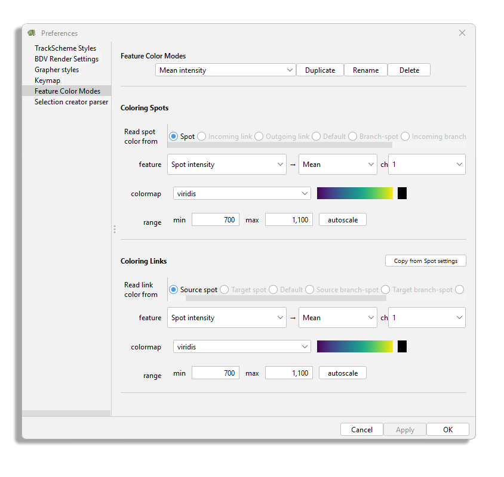

Coming back to the color mode configuration, next we need to pick a color-map. 
A color-map acts as the LUT for an image, and maps a color to a certain value.
Mastodon ships about 20 of them, many taken from the [MatPlotLib project]( https://matplotlib.org/3.1.1/gallery/color/colormap_reference.html). 
Finally, you have to specify a min value and a max value that will act as the brightness and contrast values for an image.
Values below the min you defined will all be displayed with the first color of the color-map and values larger than the max with last.
The black square you see next to the graded representation of the color-map is the color used for data items for which the feature value is not present or undefined (division by zero, _etc_).
The `autoscale` button computes the min and max automatically from the feature currently selected with the values taken from the last feature computation.

The link coloring works exactly the same, except for the link color
mode.

-   `Link` means that a link will be colored by a feature value it owns.
-   `Source spot` will take a feature value from the source spot of this link, that is, the first in time.
-   `Target spot` does the same but for the last spot in time of this link.
-   `Default` mode does not rely on feature values but simply uses the default color in the view.

To build our example feature color mode, choose `Source spot` as color mode, and use for instance the `viridis` color-map along with 700 and 1100 for min and max values. 
Do the same for the spot color mode..

Like for tag-sets, the menu is now updated with items corresponding to the color modes we created.
If they are grayed-out, it means that the feature values they depend on is not yet computed. This kind of view immediately reveals important aspect of the data, even at a very high level. 
For instance with our custom color mode, we can quickly find cells that are the brightest, and visually inspect how the intensity in cells change over time.

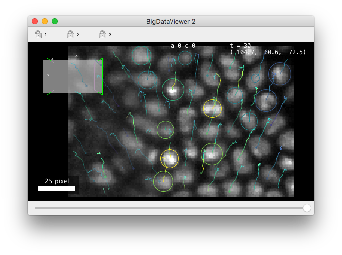
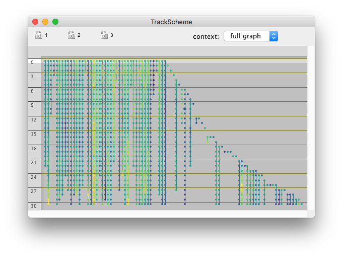

## The data table views. 

### The main table view.

The BDV and views are not suitable to display all the feature values we computed.
The coloring we have been using with them is good only for visualization purpose. 
There is a nice view to properly inspect and exploit feature values in subsequent steps in your analysis: the table view.
In practice, the table view is simply a tabular representation of the data items in Mastodon. 
Spots and links are displayed in a list where a single row corresponds to a data item, and columns to feature values and tags.
You can create a new table view by using the menu . 
If you did not compute features and did not define and tag-set, it should look like the table below:

<figure markdown>
   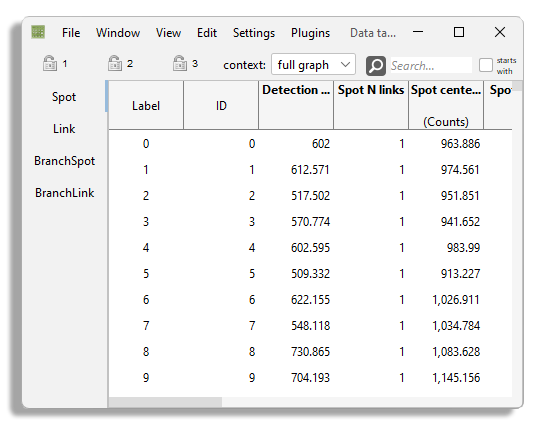{width="45%"}
   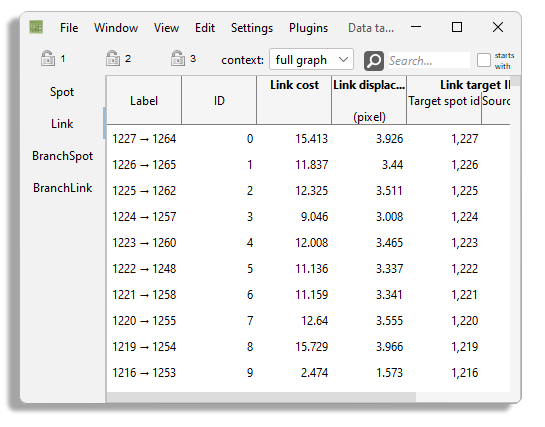{width="45%"}
  <figcaption><i>The table view, with no features computed and no tags defined. Left: the table for spots. Right: the table for links. </i></figcaption>
</figure> 
 

The view is made of several tables, the first one for spots and the second one for links. 
We will discuss the others later.
Right now it is pretty empty.
The spot and link tables only show the label and ID of the spots and a few feature values that are built-in. 
But they do not show the spot intensity features we configured above.
Navigating in this table is done classically: the arrow keys `↑` and `↓` jump from one row to the next, and `←` and `→` from one column to the next.
`⇞` and `⇟` jump page per page. `Control ⇞` and `Control ⇟` moves across tables..

After computing some features and defining some tag-sets, the table shows new columns 
Note that the column headers represent the feature with their projection and physical units on several rows.
For instance, the `Spot intensity` feature name is displayed on the first row of the column header. 
The header is split in two columns on the second row, one for each projection included in the feature.
And in the third and last row, the units of each projection is display in brackets (`Counts` in this case). 
The header of the tag-set columns are similar. 
The first row shows the name of the tag-set, and the second row shows each of the tag the set contains, with the tag chosen color as background.

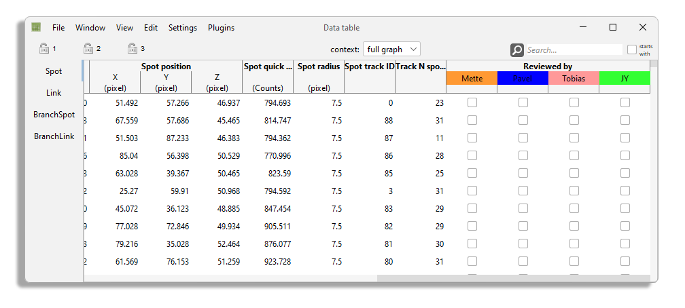

The table view can be used to edit in part the data.
For instance you can edit the spot label directly in the table.
Just navigate to the row of spot you want to change the name of and the `Label` column, then press `F2`.
The label field becomes editable. 
When you are done editing, press `Enter`.
The tags are displayed as check-boxes in the table, that you can set directly by clicking on them.
Or you can navigate the desired row and column and set them with the `space` key.

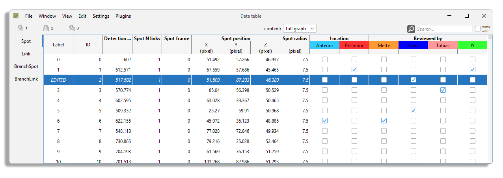

The highlight and selection are also shared with table views. 
When the table view is not active, selected items are shown with a gray background.
The highlight spot or link is shown in the table with a thick black border.
To add rows to the selection, the default key-bindings are again standard. 
Press `Shift Left-click` to add a range of rows to the selection from a table view, or use `Shift ↑` or `Shift ↓`  or `Shift ⇞` and `Shift ⇟`. 
By pressing `Control Left-click` or `Command Left-click` you can toggle single rows in and out of the selection. 
Of course, all of the commands related to the selection we have seen before also apply to the table views.
The shortcuts to navigate in the table views are summarized in the [table of table shortcuts](table_table_navigation_keys.md).

Another feature of data tables is that they can be made slave of a spatial context, like for TrackScheme.
When another BDV view is active, you can select its name in the drop-down list on the top-right part of the table.
Then the table only shows the data items that are currently displayed in the master BDV view. 
The notion of spatial context is explained in the [previous tutorial](inspecting_large_datasets.md#spatial-context-in-trackscheme).

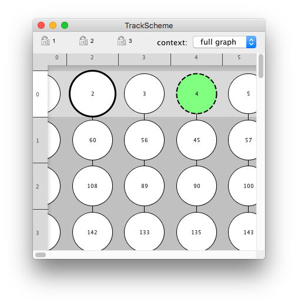{width="45%"}
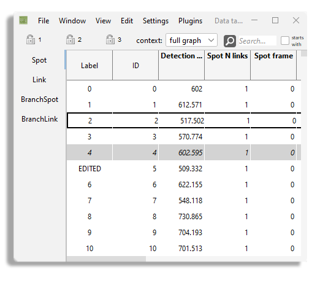{width="45%"}

### Sorting rows.

The table can be sorted by clicking on the header of the column you want to use for sorting. 
It works for labels, IDs, feature values and tags

### The selection table.

There exists a variation of the table view, but that display only what is currently in the selection.
To display such a table, go to `Window > New selection table` in the menu. 
The selection table that appears only shows what is in the selection, and is constantly updated to reflect changes in the selection. 
You cannot use it to edit the selection like in the main table.
However the row you pick in this table will set the focus and highlight in other views. 
Everything else applies to the selection table.

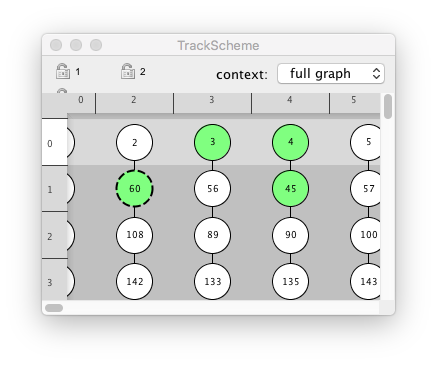{width="45%"}
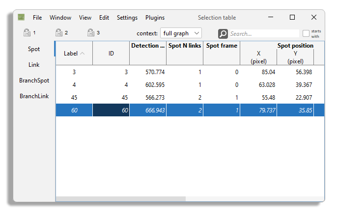{width="50%"}

### Feature-based coloring in table views.

Of course, feature based coloring works with the table views.
And it can give a pleasant display when combined with sorting rows by a feature column.

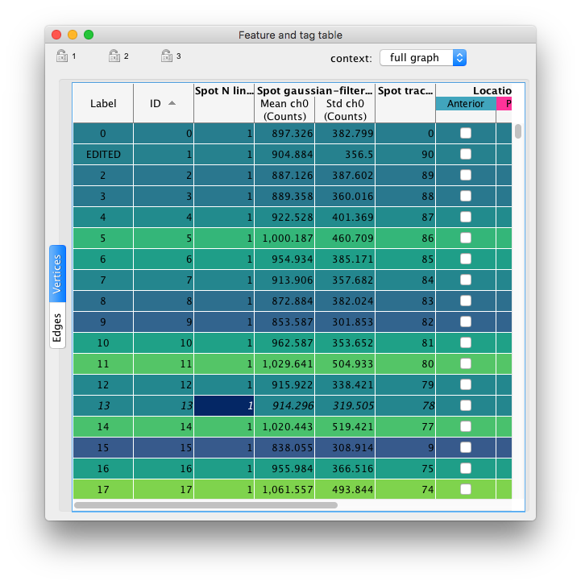

### Exporting table data.

The data currently displayed in a table view can be exported to CSV.
When a table window is active, select the menu item `File > Export to CSV`.
You will have to specify a saving location and a name. 
Only the data displayed in the currently visible table are saved, and ordered as in the view. 
This means that if you call the command from a selection table, only the current selection will be saved.

