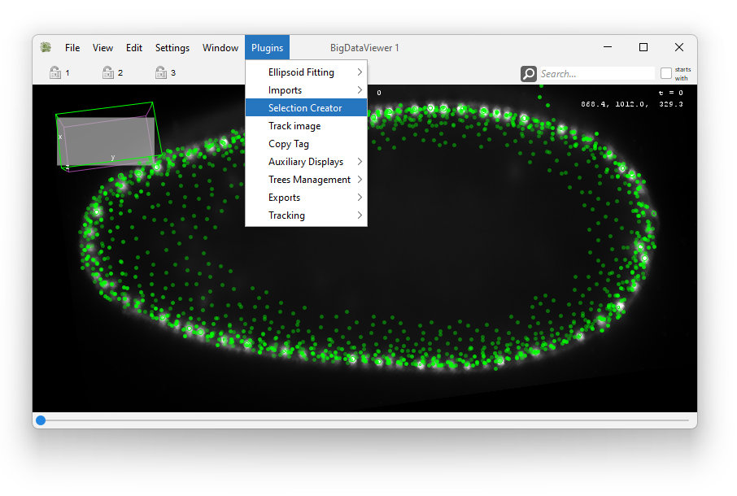
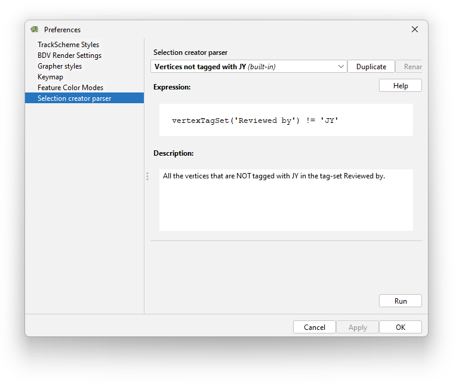

# The selection creator. 

The automated detection process we use often generates a lot of spurious
detections.
In [TrackMate](https://imagej.net/plugins/trackmate/) we complemented it by adding *feature filters* just after the detection step.
In TrackMate UI it takes the shape of filter windows, where the user can specify a feature and a threshold above or below which spots are rejected. 
The filters can be stacked to generate a more stringent filtering. 
This approach is like fishing with a small-hole net, then throwing back unwanted fishes to sea.

In Mastodon we take a somewhat different approach. 
We don't have a filter interface, but instead work with a dedicated tool called the **selection creator** that we describe it here. 
It works differently from the interactive selection we have in TrackMate.
Instead of manually clicking on spots or links, or drawing a selection rectangle in TrackScheme, you will enter an _expression_ that will be parsed to generate a selection.
The expression uses a basic language that allows translating criteria like _select all spots that have an intensity larger than X and their links_.

We thought this approach would be more convenient and powerful, and the selection is especially important in Mastodon. 
Indeed:
- You can create a selection to tag several data items that follow a certain criterion.
- The selection can be used as an input for the linking algorithms (see the [getting started tutorial](../partA/getting_started.md)).
- The BDV views can be used to only show the selection you just created.
- The selection content can be inspected in the selection table and inspected with the grapher views.

## The selection creator window.

We will be using the TRIF dataset from the cell tracking challenge for this tutorial. 
You can download the Mastodon file here TODO, that open an image stored on the Pasteur BDV-server and have some basic tracks.
The selection creator tool can be called from the _Plugins > Selection Creator_ menu, but is also a tab in the Preferences window:





The window for the tool is very simple.
It contains a text field for the expression, and another one that contains an editable description.
The `Run` button evaluates the current expression, which results in an error or in the selection being modified.
Several built-in examples are included, and there is a `Help` button that opens a document recapitulating the expression syntax.
Expression are stored and saved with the same menu that for the settings (TrackScheme styles, BDV render settings, etc).

## Selection based on spot feature values.

Let's see how we can select spots based on numerical features.
We will be mainly playing with the expression field.
First, in the top drop-down list, select the builtin example called `X larger than 100`, then click the `Run` button. 
This should be displayed:


And in a BDV window, you should see that most of the spots have been selected, saved for a few.


Let's have a look at the expression we used.
In the selection creator, you enter expressions that are evaluated for all the data items.
The expression must evaluate to a boolean answer: a `true` or `false` answer for each of the data item currently in mastodon. 
In our example we have:

```
vertexFeature('Spot position', 'X') > 100.
```
The keyword `vertexFeature` is a function that will fetch numerical values from a spot feature, for all spots. 
The arguments of this function are first, the feature name (`Spot position`) and second, the projection name `X`. 

Indeed, many features aggregates several _projections_.
A projection is a component of a feature that is always a real scalar. 
For instance, the `Spot position` feature is composed of 3 projects: `X`, `Y` and `Z`.
See the part on numerical feature computation in the [tutorial on the table views](../partA/numerical_features_tags_the_table_view.md) for more details.
Anyway, we need to remember that the `vertexFeature` function will return a scalar value for all spots, so it needs a feature _projection_ to be specified.

In the last part of the expression, we have a boolean comparison resulting in a boolean result: `> 100.` (the dot only stresses that 100 is floating point number).
So with this expression, all the spots that have a X position larger than 100 will evalute to `true` with this expression, and therefore will be added to the selection. 

This is the basis for the whole selection creator framework.
You can enter any kind of mathematical expression based on the keyword supported, and it will be turned in a selection if it evaluates to a boolean results. 

## Let's make errors.

Because the selection creator accepts expressions that can be anything, it is likely that we will have error messages at some point. 
Let's spend some time generating errors on purpose.

First let's try removing the comparison:
```
vertexFeature('Spot position', 'X')
```
If we click the `Run` button we get the following error message:
```
Evaluation failed. Got unexpected result: VertexFeature( Spot position → X, 256609 )
```
This is expected. 
The selection creator expects expressions to evaluate to booleans. 
When we removed the comparions (`< 100.`) we returned the X position for the 256609 spots in the model, and the selection creator does not know how to turn this into a selection.
So we need to remember that we always need to use expressions that evaluates to booleans.

Let's test an expression without specifying the projection name in the `vertexFeature` function:
```
vertexFeature('Spot position') > 100.
```
Now we get:
```
Evaluation failed. Incorrect syntax: Calling vertexFeature: The projection key 'Spot position' is unknown to the feature 'Spot position'.
```
Here the selection creator complains because we did not specify the projection in the call.
It then tried to find a projection with name identical to the feature name (`Spot position`) and could not find one.
So it complained. 
We would get the same error message if we tried calling the function with the name of a projection that does not exist. For instance `vertexFeature('Spot position', 'U') > 100.`

A similar error would be triggered when calling a feature that does not exist. 
For instance:
```
vertexFeature('Tralala', 'X') > 100.
```
returns the error message:
```
Evaluation failed. Incorrect syntax: Calling vertexFeature: The feature 'Tralala' is unknown to the feature model.
```

Importantly, the same error message is triggered when you call the function **with a feature that has not been computed yet**.
For instance, in the Mastodon file you just downloaded, all feature are computed exccept one: `Track N spots`.
If we try to select short tracks with the valid expression that follows:
```
vertexFeature('Track N spots') < 20
```
we would get the same error message (feature unknown).
To fix this, you need to go to the `Feature computation` tool, make sure the `Track N spots` feature computer is selected and click `Compute`. 
After this, the expression will evaluate to a selection correctly:

```
Evaluation successful. Selection has now 33316 spots and 0 edges.
```

## Selection with link features.

