# Semi-automated tracking.

Let us suppose we are dealing with a difficult image in which me must track only a subset of cells.
The cells are difficult to track automatically, for instance because there are many spurious structures labelled.
Or because there are other cells of different sizes in the tissue we are studying. 
Or because the image quality varies in time and space.
The data is such that that fully automated algorithms introduced in the first tutorial won't give us fully accurate results. 
We can use the manual editing tools introduced in the second tutorial and curate the results of automated tracking, manually removing spurious detections and links, and fixing incorrect ones.
Another approach would be to start from a blank annotation and track manually only the cells we are interested in. 
Both approaches might be long and tedious.
We introduce in this tutorial tools for semi-automated tracking, that should alleviate the work of the second approach.

Semi-automated tracking is simply a way of following a specific cell that you picked-up manually.
The tracker will follow the cell over time, and create spots and links for a certain amount of time-points. 
It searches for the best spot candidate in the next time-point around the location of the spot.
It then creates a new spot there and links it to the previous one.
This procedure is repeated this for a certain number of time-points you can set, creating or augmenting a track starting from the spot you selected.

The semi-auto tracker can be configured to work backward in time (backtracking), to have a certain search radius, or a certain sensitivity to spot quality.
The way it interacts with existing annotation can be configured too. 
You can make it stops when it meets an existing spot, linking to it or not. 
You can make it connect to small tracks and resume tracking when it meets the track end. 
You can force it to only create links on already existing spots. 
These configuration options give rise to several use-cases we will also survey in this chapter. 
But the important message is that semi-automated tracking is a convenient means for dealing with difficult cases, when a fully automated approach fails, and when the data to track is large that doing it manually is inconvenient. 
Or when you only care for a subset of cells in a dense tissue.

## Simple semi-automated tracking.

We will introduce semi-automated tracking on a movie with empty annotation. 
Open the dataset we have been using so far, and clear all annotations (for instance select all  `Control A` then delete selection `Shift ⌦`). 
Then pick a cell in the top layer, and create a spot, centered on its brightest part, as is done below.
Adjust its radius and select it.
Open a TrackScheme window to visualize the tracking progress.

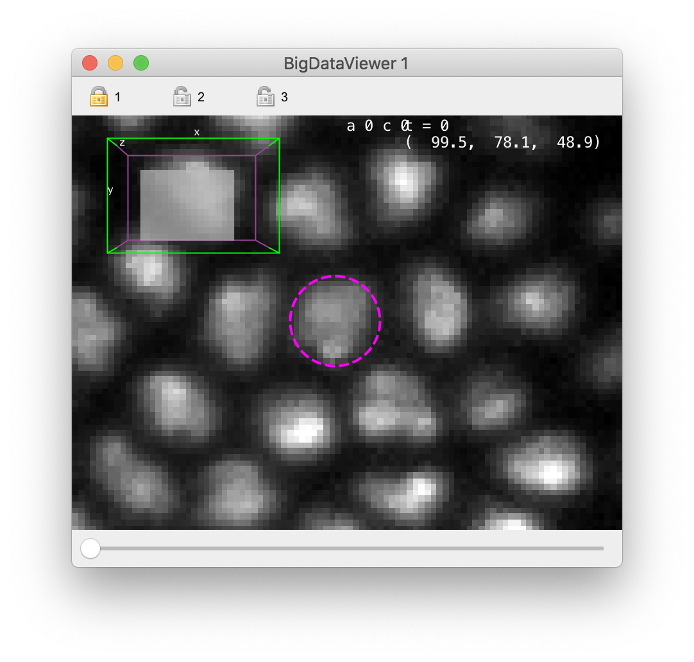
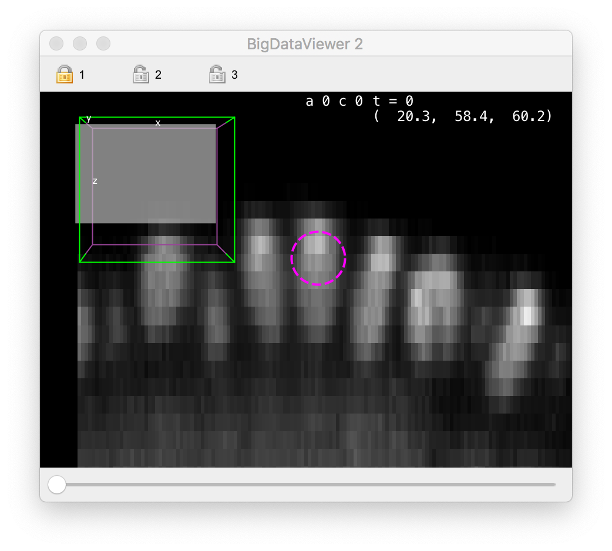

To start semi-automated tracking, press `Control T`.
A log window should open, and tracking should proceed.
If the log does not complain about candidates being too far, you should end up with something resembling the images below.

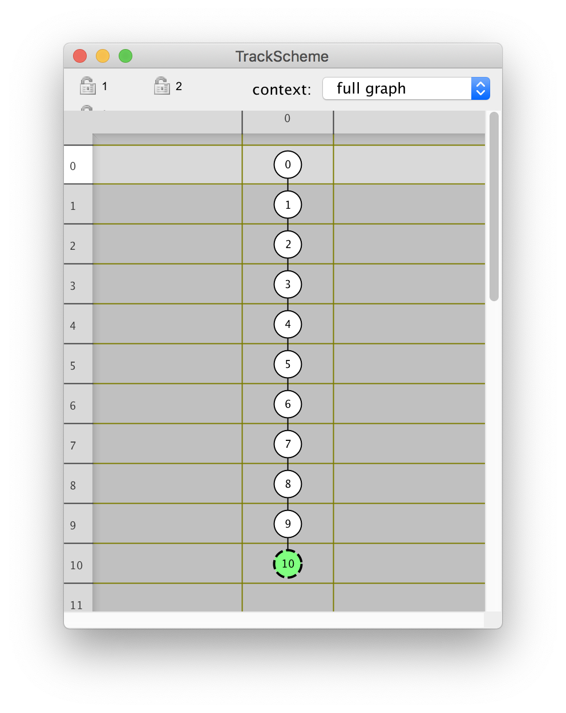
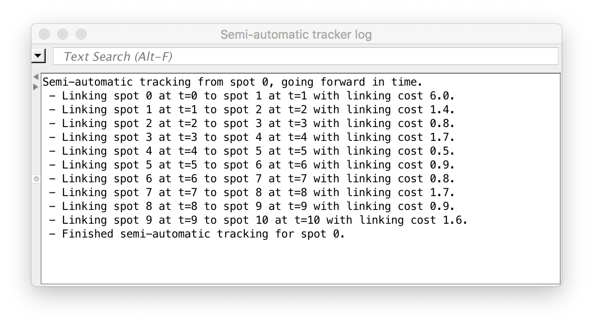

The tracking stopped after 10 frames, and the last spot added is now in the selection. 
Each spot is centered on the cell we started with, and it has the same radius that of the first spot we created.
You can resume semi-automated tracking from the last spot created by just pressing `Control T` again.
If you do it one more time you should reach the end of the movie, with a new track following a single cell over the full movie duration.
To get it, you just had to press `Control T` 3 times.
If you have more than one cell in the selection, they will be tracked one after another.

## Configuring the semi-automated tracker.

The tracking does not always succeed. 
Depending on where you position the initial spot, it might fail, for instance stating in the log that if found a suitable spot, but outside the tolerance radius. 
(In this example movie, this happens often because the cells are very elongated along the Z direction, and the tracker tends to find candidates near the top, brightest part of the cell.) 
The parameters that control for instance the tracker search radius can be set in the semi-automated tracking configuration dialog, in the . The window show in _Plugins > Tracking > Configure semi-automatic tracker_.
The following window should appear.

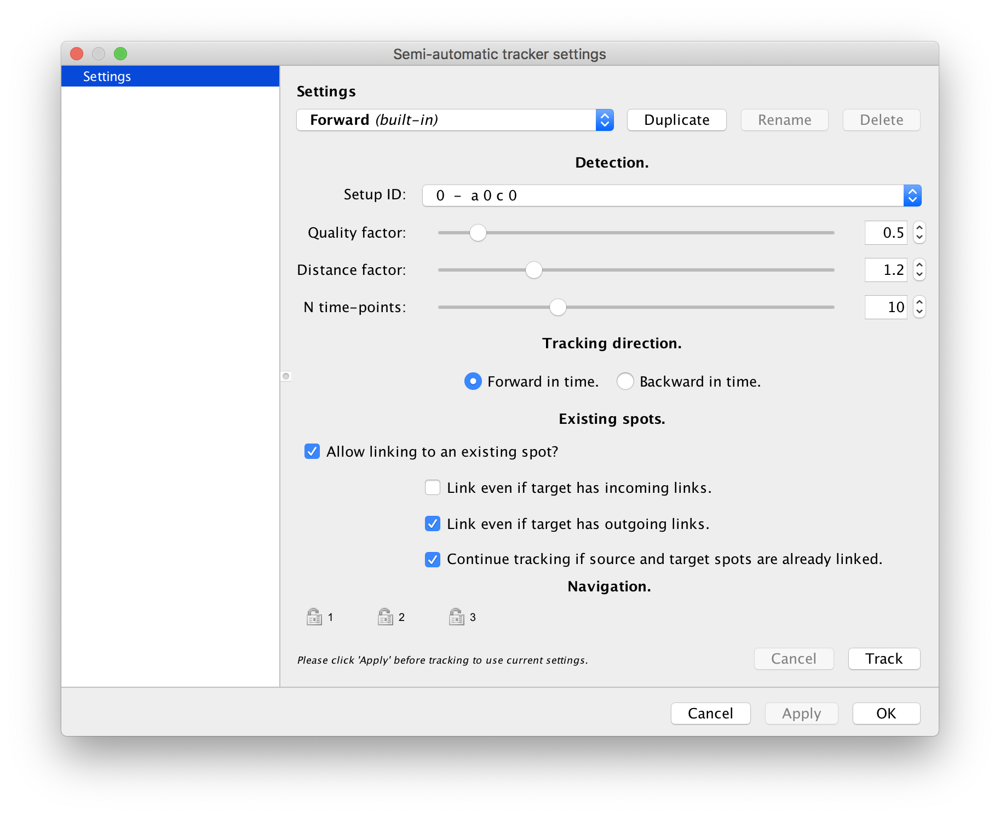

This dialog is very similar to the one used to configure feature color modes, that we
have seen the tutorial just before.
It also works the same way: the top elements are made to manage several tracking configuration, that will be stored on disk and retrieved in your next Mastodon session.
There are two default tracking configuration: the **Forward** one is the default that we just used.
The **Backtracking** configuration tracks backward in time.
The other parameters controls the tracker behavior for the configuration currently selected in the top drop-down list. 
To explain what they do we need first to describe how the semi-automated tracker works:

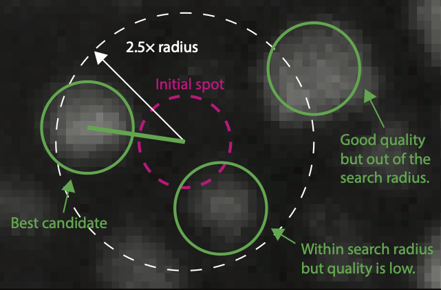

The semi-automated tracker works by processing only a small neighborhood around the initial spot, (called the *source* spot later).
This neighborhood is centered on the spot center (in magenta above), but taken in the next time-point (or previous one if you choose to go backward in time). 
It applies the DoG detector (described in the first tutorial) on this neighborhood, which yields several detections (green circles). 
The detections that are found outside of a search radius (white, dashed circle) are not considered.
Detections inside the search radius but with a low quality are discarded as well.
The tracker therefore select the detection with a sufficiently large quality inside the search radius.
If there is more than one suitable detection, it selects the one with the highest quality. 
A new spot is created at this location, with the same radius that of the source spot.
If the source spot is not a sphere but an ellipsoid, the smallest radius of the ellipsoid is taken.
The newly created spot is then linked to the source spot.
This is then repeated for the next time-point (or previous one), using the new spot as initial spot in the same process.
If no suitable detections are found within the search radius, the tracker stops, and the reason is printed in the tracker log window.

The configuration panel controls the parameters of this process.

-   `Setup ID` specifies what channel (or setup in case you have a multi-view dataset) that will be used for the detection.
-   `Quality factor` specifies the threshold on quality below which we reject detections.
This threshold is expressed in fraction of the source spot quality.
For instance if the source spot quality is 60 and the `Quality factor` is 0.5, detections with a quality lower than 30 will rejected.
If the source spot has no quality value (it was added manually), this parameter is ignored and all quality values are accepted.
-   `Distance factor` specifies the search radius, in units of the source spot radius. 
For instance, for a value of 2.5, only detections that are within 2.5 times the radius of the source spot will be considered.
Again, if the source spot is not a sphere but an ellipsoid, the smallest radius of the ellipsoid is taken.
-   `N time-points` specifies the number of time-points after which to stop.
-   `Tracking direction` lets you specify whether you want tracking to happen forward or backward in time.

If you see that the tracker often stops with a message stating that it could not find a suitable candidate within search radius, try to either decrease the value of the `Quality factor` or increase the value of the `Distance factor`.

## Tracker behavior with existing annotations.

The next parameters below the **Existing spots** category configure how the tracker deals with existing annotations. 
They change the behavior described in the previous section.
Indeed, before running the DoG detector on the neighborhood, the tracker first searches for an existing spot within the search radius.
If it finds one, it does not run the DoG detection, but links to the existing spot (called *target* spot later) or not, depending on the following parameters.

If the `Allow linking to an existing spot` checkbox is deselected, the tracker stops.
If it is selected, the tracker will link to the target spot, provided it has no links already. 
However, the next 3 parameters allow to add exceptions:

-   `Link even if target has incoming links`
-   `Link even if target has outgoing links`
-   `Continue tracking if source and target spots are already linked`

Their selection have important consequences when you are tracking along existing spots. 
They are best exemplified by several different use-cases.

## Main use-cases for semi-automated tracking.

### Tracking a subset of cells. 

This is what we have been doing in the first section of this chapter.
This does not require any special configuration and the default tracking configuration called **Forward** will do.
Here is an example of when this use-case can be useful.

Arianne Bercowski Rama and Laurel Ann Rohde (Segmentation Timing and Dynamics Laboratory, EPFL) are studying the somatogenesis dynamics in the zebrafish embryo. 
They acquire long-term time-lapse movies of the development of an embryo, with cellular resolution. 
For a project they wanted to follow a few cells of interest (a few dozens per movie) and investigate the expression of a gene reporter as the cells moved along the zebrafish embryo.
The nuclei are all stained with a nuclear marker, so this fluorescence channel could be used for automated detection, but there are thousands of cells. 
Instead, they relied on semi-automated tracking, selecting a the cells of interest in the first frames of the movie, and tracking them to the end thanks to the semi-automated tracker.

Once the tracking was done, they used feature analysis to extract fluorescence intensity over time for each cell in the gene reporter channel.

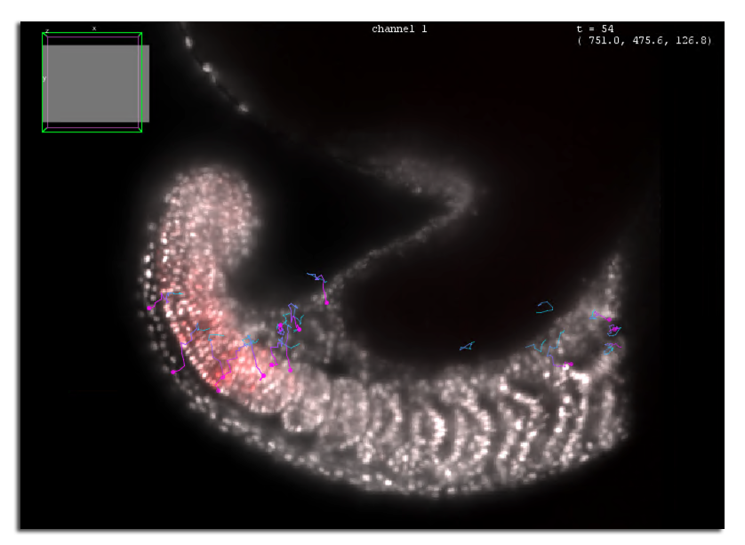
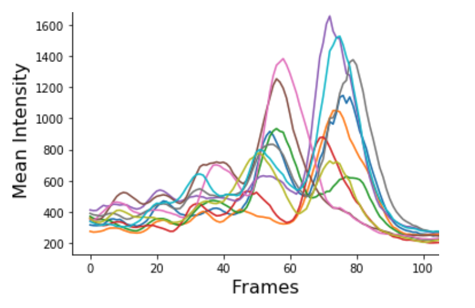

### Stitching small track segments.

The semi-automated tracker can be used with the same configuration to stitch small track segments, which follow the same cell but are separated and spread in time. 
This might be caused linking with missing detections, and the situation could resemble what is pictured below.

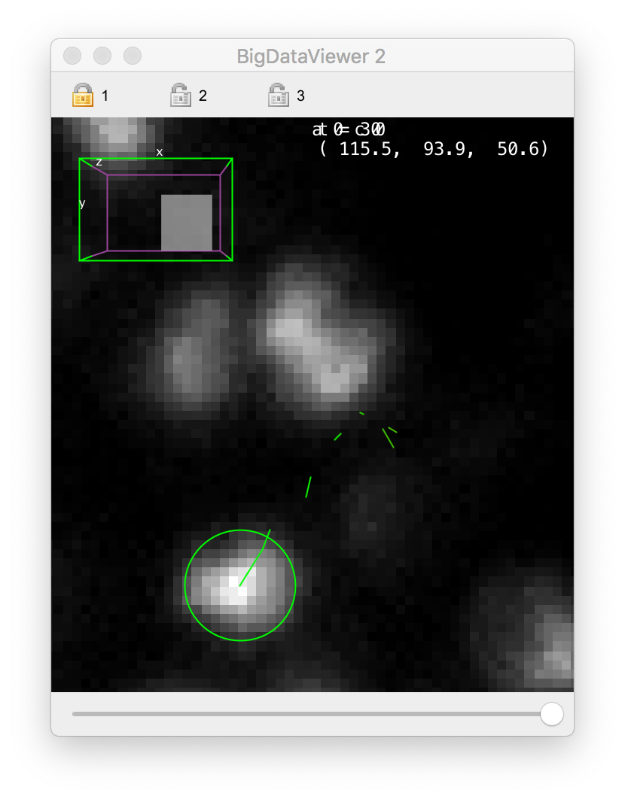
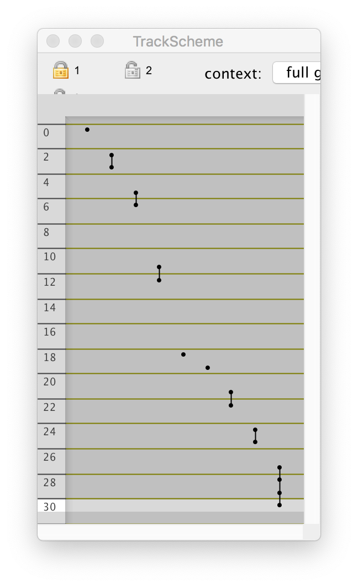

We can use the semi-automated tracker to connect them, and add the missing detections. 
We want the tracker to create spots for the cell in time-points when they are missing, and to connect to existing ones it will find by following the cell.
To allow this, we must enable first the '`Link even if target has outgoing links`' setting, so that the tracker does not stop when it meets a spot that is at the beginning of a track segment.
Second, we must enable the '`Continue tracking if source and target spots are already linked`' setting.
If we do not, the tracker will stop after connecting the first track segment it meets. 
Finally, we have to increase the value of the '`N time-points`' parameter, so that the tracker iterate through the full movie.
After doing this and tracking for the first cell, we get a single track:

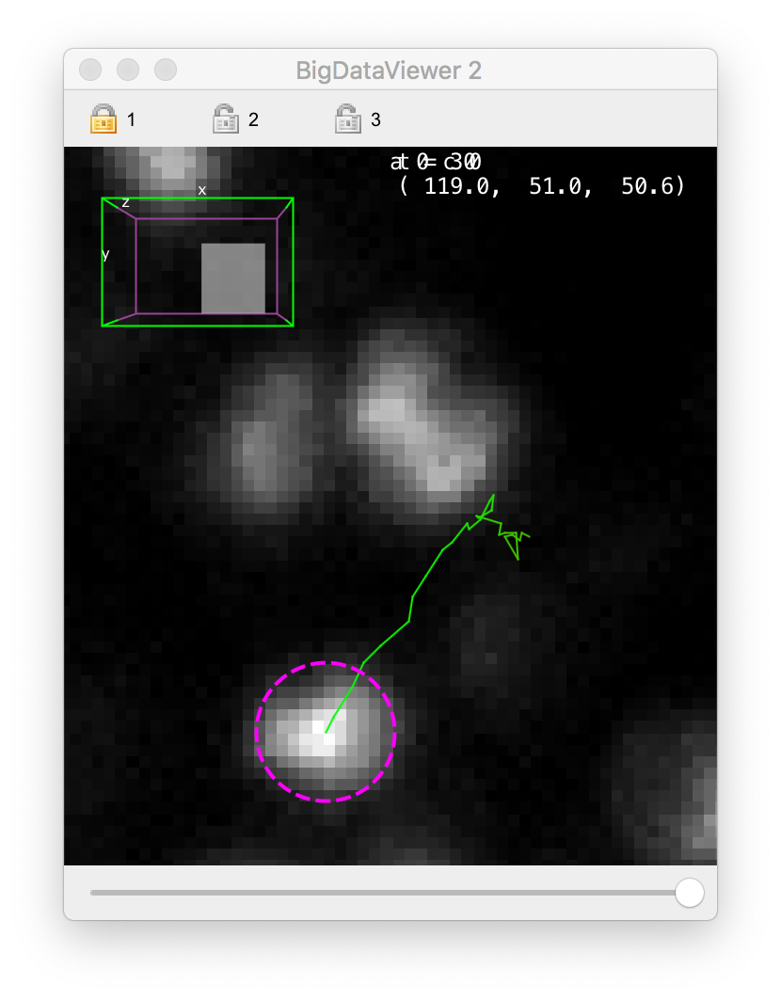
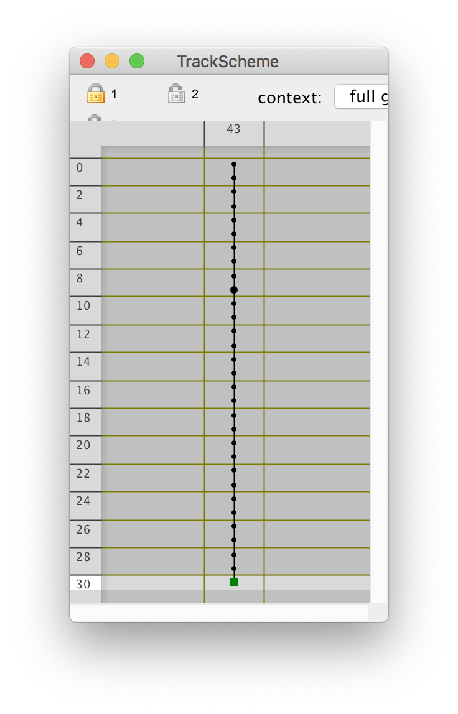
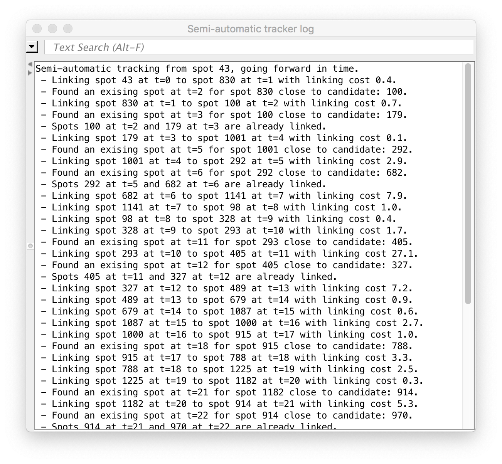

### Backtracking, branching on cell divisions. 

Backtracking is particularly useful when creating lineages of cells that divide often in the movie.
Another application is in mapping differentiated cells at a late time-point, to the position of their progenitors at the beginning of the movie. 
For this we typically starts from an empty annotation, select a cell of interest in a late time-point, and backtrack it to its position in the beginning of the movie.
The built-in configuration called **Backtracking** is made for this.
If the cell we backtrack divided several times during the movie, might be creating tracks for sibling cells.
We want these tracks to branch properly in case we meet the mother cell when it divides.

This is why we need to enable the '`Link even if target has outgoing links`' setting, but no other.
Suppose we already have one track for a cell that divides, following the mother cell then one of the daughter cells.
When we will backtrack from the other daughter cell, late in the movie, we will meet the division point of the mother cell.
There is an existing spot there, just before the cell divides.
It has already an outgoing link (to the first daughter we already tracked), and we want to connect to it. 
Hence we enable the '`Link even if target has outgoing links`' setting. 
Because we want to stop tracking there (the rest of the track is good already), we do not
enable any of the two other settings.

### Sparse linking over dense spots.
