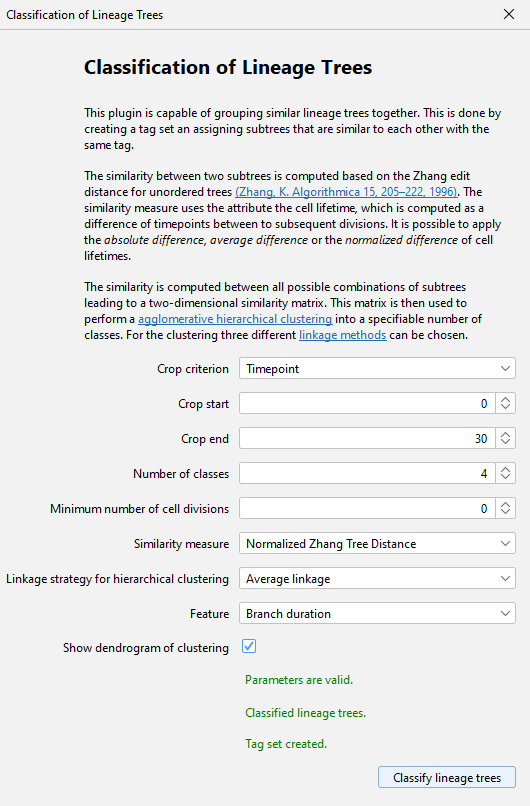
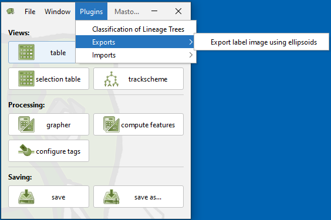
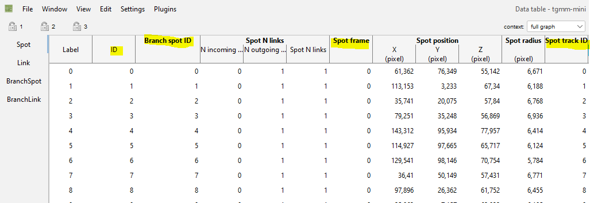

# Mastodon Deep Lineage - a collection of plugins to analyse lineages of tracked objects in Mastodon

## Installation instructions

* Add the Mastodon-Dev update site in Fiji:
    * Help > Update > Manage update sites > Add Unlisted Site
        * Name: Mastodon-Dev
        * URL: https://sites.imagej.net/Mastodon-Dev/
        * 
* Add the Humble-Video update site in Fiji:
    * Help > Update > Manage update sites > Add Unlisted Site
        * Name: Humble-Video
        * URL: https://sites.imagej.net/Humble-Video/
        * 
* Add the Mastodon Deep Lineage update site in Fiji:
    * Help > Update > Manage update sites > Add Unlisted Site
        * Name: Mastodon-DeepLineage
        * URL: https://sites.imagej.net/Mastodon-DeepLineage/
        * 

## Numerical Features added to Mastodon

### Spot Features

| **Feature name**             | **Projections**                                   | **Description**                                       | **Formula/Visualisation**                                                                                              |
|------------------------------|---------------------------------------------------|-------------------------------------------------------|------------------------------------------------------------------------------------------------------------------------|
| Spot Ellipsoid               | Short semi axes, Middle semi axis, Long semi axis | The ellipsoid semi axes in ascending order of length. | The semi axes are computed applying the square root to the eigenvalues of the so-called covariance matrix of the spots |
|                              | Volume                                            | The volume of the ellipsoid.                          | $V=\frac{4}{3} \pi a b c$                                                                                              |
| Spot Ellipsoid Aspect Ratios | Aspect ratio short to middle                      | The ratio between the short axis and middle axis.     | $\frac{\text{short axis}}{\text{middle axis}}$                                                                         |
|                              | Aspect ratio short to long                        | The ratio between the short axis and long axis.       | $\frac{\text{short axis}}{\text{long axis}}$                                                                           |
|                              | Aspect ratio middle to long                       | The ratio between the middle axis and long axis.      | $\frac{\text{middle axis}}{\text{long axis}}$                                                                          |
| Spot Branch ID               | _idem_                                            | The ID of the branch spot each spot belongs to.       |                                                                                                                        |

### Branch-spot features

| **Feature name**   | **Projections** | **Description**                                                                                                                                                                                                                                                                                  | **Formula/Visualisation**                                                                                                    |
|--------------------|-----------------|--------------------------------------------------------------------------------------------------------------------------------------------------------------------------------------------------------------------------------------------------------------------------------------------------|------------------------------------------------------------------------------------------------------------------------------|
| Branch N Leaves    | _idem_          | The total number of leaves of a branch spot in the whole track subtree of this branch spot.                                                                                                                                                                                                      |                                                                                 |
| Branch N Successor | _idem_          | Total number of successors of a branch spot in the whole track subtree of this branch spot.                                                                                                                                                                                                      |                                                                             |
| Branch Sinuosity   | _idem_          | Computes the sinuosity of a spot during its life cycle (cf. [Sinuosity](https://en.wikipedia.org/wiki/Sinuosity)), i.e. how much the track represented by the branch is curved. Values close to 1: almost straight movement. Values significantly higher than 1: winding or meandering movement. |  <br><br> i.e.: <br><br>  |

## Lineage Tree Classification

* This plugin is capable of grouping similar lineage trees together.
* The similarity of a pair of lineage trees is computed based on the Zhang edit distance for unordered
  trees ([Zhang, K. Algorithmica 15, 205–222, 1996](https://doi.org/10.1007/BF01975866)). This method captures the cost
  of the transformation of one tree into the other.
* The cost function applied for the tree edit distance uses the attribute branch spot duration, which is computed as a
  difference of time points between to subsequent divisions reflecting the start and the end of a spot's lifetime.
* Thus, the linage classification operates on Mastodon's branch graph.
* The Zhang unordered edit distance allows the following edit operations:

```
  Note: The prefix T may represent a node or a complete subtree. Nodes without this prefix are just nodes.
  
  1. Change label
        A         A'
       / \  ->   / \
      TB TC     TB TC
  
  
  2a: Remove subtree (opposite of 2b)
         A         A
        / \   ->   |
       TB TC       TB
  
  2b: Add new subtree (opposite of 2a)
  
        A          A
        |    ->   / \
        TB       TB TC
  
  
  3a: Remove subtree but keep one child (opposite of 3b)
  
         A          A
        / \   ->   / \
       B  TC      TD TC
      / \
     TD TE        (remove B and TE, keep TD)
  
  3b: Convert existing subtree into child of a newly inserted subtree (opposite of 3a)
         A             A
        / \    ->     / \
       TB TC         D  TC
                    / \
                   TB TE       (insert D and TE, keep TB)
  
  
  4a: Remove subtree (and siblings) but keep all children (opposite of 4b)
         A               A
        / \             / \
       B  TC   ->      TD TE
      / \
     TD TE            (Subtree B and it's sibling TC are removed, but the children
                       of B namely TD and TE are kept)
  
  4b: Convert existing subtrees into children of a newly inserted subtree (opposite of 4a)
         A               A
        / \             / \
       TB TC   ->      D  TE
                      / \
                     TB TC       (Subtree D and it's sibling TE are newly inserted,
                                  TB and TC are kept as children of D)
```

* A basic example of the tree edit
  distance:

```
Tree1
	                        node1(node_weight=13)
	               ┌──────────┴─────────────┐
	               │                        │
	             node2(node_weight=203)   node3(node_weight=203)
```

```
Tree2
	                        node1(node_weight=12)
	               ┌──────────┴─────────────┐
	               │                        │
	             node2(node_weight=227)   node3(node_weight=227)
	                             ┌──────────┴─────────────┐
	                           node4(node_weight=10)    node5(node_weight=10)
```

* Edit distance of 69, because:

    * one node has a difference of 1
    * two nodes have a difference of 24 each
    * two extra nodes are added with a weight of 10 each
    * $\text{Zhang Tree Edit Distance}_{Tree1,Tree2} = 1 + 2 \times 24 + 2 \times 10 = 69$
* The tree edit distances are computed between all possible combinations of lineage trees leading to a two-dimensional
  matrix. The values in this matrix are considered to reflect similarities of lineage trees. Low tree edit distances
  represent a high similarity between a discrete pair of lineage trees.
* This similarity matrix is then used to perform
  an [agglomerative hierarchical clustering](https://en.wikipedia.org/wiki/Hierarchical_clustering) into a specifiable
  number of classes.

### Parameters:

* Crop criterion:
    * Time point (default)
    * Number of spots
* Crop start
* Crop end
* Number of classes (minimum 2)
* Minimum number of divisions
* Similarity measure:
    * Normalized Zhang Tree Edit Distance (default). $\frac{distance_{treeA,treeB}}{distance_{treeA,emptyTree} +
      distance_
      {treeB,emptyTree}}$
    * Per Branch Spot Zhang Tree Edit Distance. $\frac{distance_{treeA,treeB}}{numBranchSpotsA + numBranchSpotsB}$
    * Zhang Tree Edit Distance as described in ([Zhang](https://doi.org/10.1007/BF01975866)).
* Linkage strategy for hierarchical clustering,
  cf. [linkage methods](https://en.wikipedia.org/wiki/Hierarchical_clustering#Cluster_Linkage)
    * Average (default)
    * Single
    * Complete
* Feature:
    * Branch duration (default and currently only selectable feature)
* Show dendrogram of clustering

### Example:

* Demo data: [Example data set](deep_lineage/lineage_classification/lineage_classification.mastodon)
    * The demo data does not contain any image data.
    * The spatial positions of the spots are randomly generated.
    * When opening the dataset, you should confirm that you open the project with dummy
      images. 
* The track scheme of the demo data containing 8 lineage tree in total. You may see that the "symmetric", the "
  asymmetric" and the "single division" trees look
  similar to each other, but dissimilar to the other
  trees. 
* The lineage classification dialog. 
* The resulting dendrogram. 
* The resulting tag set used for coloring the track
  scheme. 
* The resulting tag set used for coloring the track scheme branch
  view. 

## Label image exporter

* The Label image exporter is capable of saving a label image to a file using the existing ellipsoids in Mastodon.
* For the labels, the _spot ids_, _branch spot ids_ or the _track ids_ that correspond to the spots / ellipsoids may be
  used. Since these Ids are counted zero based in Mastodon, an **offset of 1** is added to all Ids so that no label
  clashes with the background of zero.
* The recommended export format is '*.tif'-files. However, it should work also for other formats supported by ImageJ.
* The export uses an image with signed integer value space, thus the maximum allowed id is 2.147.483.646.
* Exporter can be found here:  
* The dialog:  
    * Label Id: The id that is used for the labels. The default is the Spot track Id.
        * The ids correspond to the highlighted columns in the feature
          table: 
    * Frame rate reduction: Only export every n-th frame. 1 means no reduction. Value must be >= 1.
        * The frame number corresponds to the _Spot frame_ column in the feature table.
    * Save to: Path to the file to save the label image to.

### Example:

* Demo data: [Example data set](https://github.com/mastodon-sc/mastodon-example-data/tree/master/tgmm-mini)
* The timelapse with the ellipsoids in
  BigDataViewer: 
* The exported tif imported into [Napari](https://napari.org/stable/) 3D
  view: 
