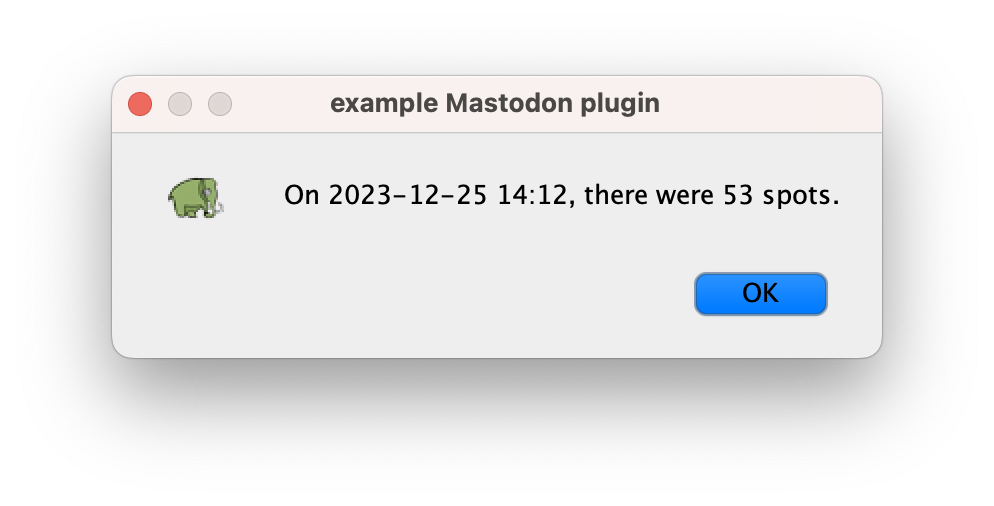
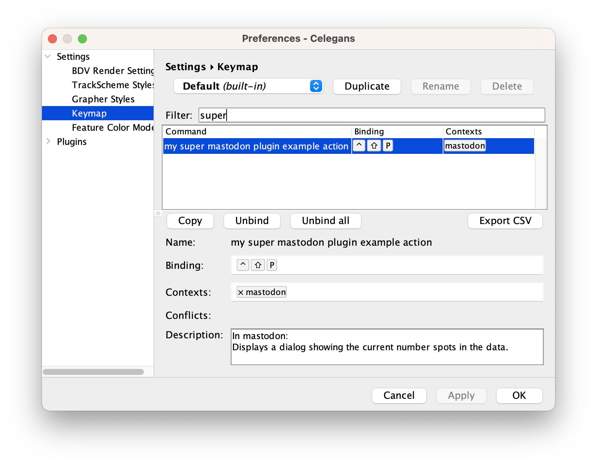
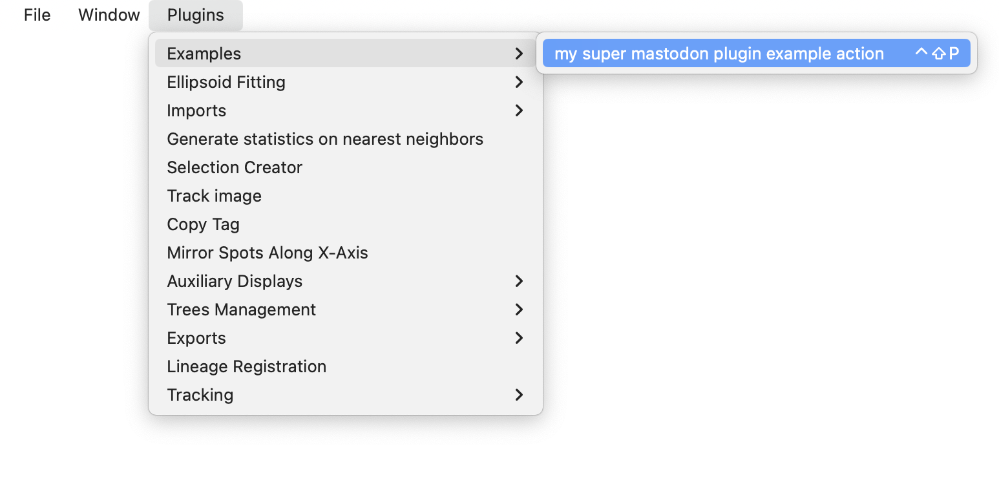
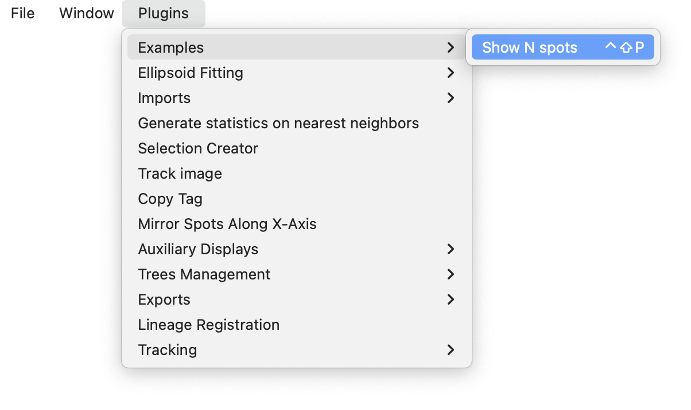

# Creating custom plugins in Mastodon.

Here we introduce how to write your own plugins in Mastodon.

A Mastodon plugin is a piece of code that implements a functionality that you can define and distribute, without depending on editing the core of Mastodon code, or on any action from the core developers. 
We built the plugin system and documented it so that extending Mastodon can be done without the core developers intervention, or even without us knowing about it.
To achieve this, we rely on [SciJava](https://imagej.net/libs/scijava#plugin-framework).
This core library offers a very simple and efficient plugin discovery mechanism.
WIth it, you can write some code in Java, compile it in a jar file, drop the jar file in Fiji, and Mastodon will automatically pick it up, and integrate the functionality it ships.
As an example, all [TrackMate components](https://imagej.net/plugins/trackmate/#trackmate-components) use the same mechanism, making it fast and easy to add new functionality to this software.

As opposed to other ways of extending Mastodon reviewed next, a Mastodon plugin is very generic. 
It can have any goal that you envision, and does not have limitations in what you have access to. 
You can use a Mastodon plugin to implement and import / export filter, a specific analysis tool, or a feature that edits the model. 

## The code template.

We will use and document a template file that is included in an example repository. 
You can clone it from:

> [https://github.com/mastodon-sc/mastodon-plugin-example](https://github.com/mastodon-sc/mastodon-plugin-example)

The simplest approach to start developing your plugin would be to simply edit this repository, changing its name, editing the `.java` files and modifying the content of the `pom.xml` file. 
Maven will generate a `.jar` file that you can drop in the `Fiji.app/jars` folder.
Provided that this Fiji has Mastodon installed in it, the extensions you will develop within this code will be discovered and integrated into Mastodon.

In the template you will see that there are several examples, each focusing on one of the multiple specific extensions of Mastodon. 
Here we will just focus on the general plugin, for which an example is in the class:

> `src/main/java/org/mastodon/mamut/example/plugin/MastodonPluginExample.java`

([Or online](https://github.com/mastodon-sc/mastodon-plugin-example/blob/main/src/main/java/org/mastodon/mamut/example/plugin/MastodonPluginExample.java).)

This example creates a Mastodon plugin that, when called, simply displays a dialog showing the date and the number of spots in the model.
This class is fully annotated and commented, and can be read from top to bottom. 
We repeat and precise here the information that you can find in the class and directly edit.

## The plugin class hierarchy.

The class file starts with:

```java
package org.mastodon.mamut.example.plugin;

...

@Plugin( type = MastodonPluginExample.class )
public class MastodonPluginExample implements MamutPlugin
{
	...
```

### The interface to implement.

The class implements the interface [`org.mastodon.mamut.plugin.MamutPlugin`](https://github.com/mastodon-sc/mastodon/blob/master/src/main/java/org/mastodon/mamut/plugin/MamutPlugin.java),  which name and package can be surprising at first. 
Indeed, in the code  base, we tried to separate the common, general code that implements the Mastodon technology, from the user application also termed  'Mastodon', that is currently shipped in Fiji.
The Mastodon application is a Fiji end-user tool that focuses on  tracking cells and building lineages in large 3D+T images. 
But the Mastodon API could be used to build other scientific applications, not necessarily focused on tracking, or focused on tracking, but using another data model.

The code that provides the general, underlying functionality of Mastodon is placed in the `org.mastodon` package. 
The code that is specific to the Mastodon application is placed in the  `org.mastodon.mamut` package.
This part is specific to a data model class `org.mastodon.mamut.model.Model`, based on `Spot` and `Link`.
This model class is at the core of Mastodon data structure, and was surveyed in the [previous page](./mastodon_data_structures).
The classes specific to this application often have a `Mamut` in their name, as in the plugin interface we extend below.

### Suggested package.

In this example we deal with a plugin specific to the Mastodon application, so we recommend using the prefix `org.mastodon.mamut` for its package.
Then add as sub-package the part specific to the feature you implement.

### The `@Plugin` annotation.

The `@Plugin` annotation you see in the line just above the class declaration is used by Mastodon to automatically discover your plugin at runtime. 
This is the medium of the SciJava discovery mechanism.
If you do not add it, Mastodon will not find the plugin and it won't be usable in the application.
In the `type = XXX.class` you simply need to put the name of the current class.

## The plugin interface methods.

The interface only defines 4 methods, with only the first one mandatory.
But of course it is sensible to implement all of them to present a nice integration to the user.

1. Passing the data to the plugin:
```java
public void setAppPluginModel( final ProjectModel projectModel )
```

2. Declaring to Mastodon what actions are contained in the plugin class:
```java
public void installGlobalActions( final Actions actions )
```

3. Inserting the actions in the Mastodon menu:
```java
public List< MenuItem > getMenuItems()
```

4. Fine-tuning the action names displayed in the menu.
```java
public Map< String, String > getMenuTexts()
```

5. And finally, you can document for the user what each action does.
This is not done through a method, but with a specific inner class:
```java
@Plugin( type = Descriptions.class )
public static class Descriptions extends CommandDescriptionProvider
{
	...
```

We will now detail each.

## Passing the data to the plugin.

This is done with the method `setAppPluginModel()`.
It is only used by Mastodon to pass the project model (all the important data) to the plugin. 
It is called only once, automatically after the image data and tracking data is loaded, and before the user interface is displayed.

The project model has all the important project data, window manager, and tools to execute or show something. 
The role of this method can be first to store it or pass it to the class that will actually perform the work.
In this example, the class that will _do_ something is a named `action`, defined below in the code. It is a named action that we can instantiate now, passing the project model in its constructor.

So the code for the first part of the class is the following:

```java
package org.mastodon.mamut.example.plugin;


// All the imports.
...

@Plugin( type = MastodonPluginExample.class )
public class MastodonPluginExample implements MamutPlugin
{

	/**
	 * The custom action. In our case, this is the piece of code that will run
	 * when the user will click on the plugin menu item or use the plugin
	 * shortcut.
	 */
	private MyMastodonAction action;

	@Override
	public void setAppPluginModel( final ProjectModel projectModel )
	{
		this.action = new MyMastodonAction( projectModel );
	}
	
	...
```

## The actual plugin logic.

The code for the action class `MyMastodonAction` can be defined in the same file. 
In this example we chose to implement [`AbstractNamedAction`](https://javadoc.scijava.org/SciJava/org/scijava/ui/behaviour/util/AbstractNamedAction.html).
It is a simple refinement of the core class `AbstractAction`, that stores a name for the action.
We will see that the action name is very important, and it needs to be unique for each action.

This `MyMastodonAction` class is where you would put the logic of your action.
Depending on whether it is about showing a dialog, starting an intensive computation or connecting to a server, the boilerplate code might change.
Be mindful for instance about the fact that as is, this code will run on the [Event Dispatch Thread](https://docs.oracle.com/javase/tutorial/uiswing/concurrency/dispatch.html).

In our case we don't mind, because the code we run is trivial. 
We want to count the number of spots currently in the model. 
For this we need to access some of the project model component.

```java
	private static class MyMastodonAction extends AbstractNamedAction
	{

		private static final long serialVersionUID = 1L;

		private final ProjectModel projectModel;

		private MyMastodonAction( final ProjectModel projectModel )
		{
			/*
			 * This is where we specify the action name. We would
			 * normally recommend to put it in a String constant, at the
			 * beginning of the plugin class.
			 * 
			 * By convention, action names are all lower case, with words
			 * separated by space. This name is what the user will see in the
			 * Keymap table of the Preferences dialog.
			 */
			super( "my super mastodon plugin example action" );

			/*
			 * We simply store the project model instance.
			 */
			this.projectModel = projectModel;
		}

		/*
		 * The method below is called as many times as the user triggers the
		 * action. The `ActionEvent` parameter is not really useful to our case.
		 */
		@Override
		public void actionPerformed( final ActionEvent e )
		{
			/*
			 * The data model is one component of the project model.
			 */
			final Model model = projectModel.getModel();

			/*
			 * It contains the mathematical graph of all tracks.
			 */
			final ModelGraph graph = model.getGraph();

			/*
			 * The graph has vertices, which are the spots, or cells, in our
			 * data.
			 */
			final int nSpots = graph.vertices().size();

			/*
			 * Let's show this to the user.
			 */
			final Date now = new Date();
			final String dateTxt = new SimpleDateFormat( "YYYY-MM-dd HH:MM" ).format( now );
			final String message = "On " + dateTxt + ", there were " + nSpots + " spots.";
			JOptionPane.showMessageDialog( null,
					message,
					"example Mastodon plugin",
					JOptionPane.INFORMATION_MESSAGE,
					MastodonIcons.MASTODON_ICON_MEDIUM );
		}
	}
```

## Declaring the actions to Mastodon.

This is well and fine, but how are we going to let the user _launch_ anything? 
We want to have something done when the user triggers the plugin. 
How can we do that?
This is done using the _actions_ mechanism, used in our case with the following method:

```java
public void installGlobalActions( final Actions actions )
```

When a plugin is registered, it receives via the method above an [`Actions`](https://javadoc.scijava.org/SciJava/) instance, reserved for plugins.
We will see  how to use it, but these actions are simple mechanism to bind a shortcut or a menu item to something that runs.

But first a word on keyboard shortcut.
Mastodon has a nice system to map actions to keyboard shortcuts and  the let the user modifies them.
If you want to trigger your plugin via keyboard, you need to provide a default shortcut in the method we detail below.

The syntax to specify a keyboard shortcut is simple, but has some gotchas about the accelerators and letters. 
It is a good idea to check the supported syntax here:

> [https://github.com/scijava/ui-behaviour/wiki/InputTrigger-syntax](https://github.com/scijava/ui-behaviour/wiki/InputTrigger-syntax)

If you do not want your action to be callable directly from the keyboard, enter `not mapped` instead. If you want your action to be callable by _several_ shortcuts, enter them as an array of strings, as in:

```java
String[] keyboardShortcuts = new String[] { "ctrl shift P", "ctrl shift Q" };
```

As coding style extremists we would recommend declaring the shortcut in a `String` constant declared in the beginning of the class, so that it can be easily modified later. 

We can declare our custom action we instantiated above in the following way:

```java
actions.namedAction( theActionInstance, "the keyboard shortcut" );
```
Note that this method only required the named action instance and the default keyboard shortcut (could be `"not mapped"`, but not `null`, nor something empty). 
The action name will be taken directly from the `AbstractNamedAction` implementation, as seen in the previous paragraph.

In the end, the content of the method looks like this:

```java
	@Override
	public void installGlobalActions( final Actions actions )
	{
		final String keyboardShortcut = "ctrl shift P";
		actions.namedAction( action, keyboardShortcut );
	}
```

Alright this is done! 
Now when the user will press the `ctrl shift P`  keys, the `actionPerformed()` code of the `MyMastodonAction` above will run. 

{width="500px" align="center"}

Before we carry on: did you recognize you could declare _several_ action within this plugin class? 
In this example, we just made one, called `MyMastodonAction`, that is defined and instantiated above. 
Nothing prevents your from having several implementations of `AbstractNamedAction`, each corresponding to a different action. 
You can repeat the call to

```java
actions.namedAction( action, keyboardShortcut );
```

with each of them, and have several actions declared in the same plugin class. 
**A Mastodon plugin mainly contains the logic for the declaration of one or several actions to be run, rather than the action itself.**

## The action descriptions.

We could stop here.

We have a plugin class, that instantiate an action, declares it into the `Actions` bundle, and binds it to a specific shortcut. 
We have some code and a way for the user to trigger it.

But 1/ it does not have a description and 2/ what if you want to put thisaction into the Mastodon menu? 
Let's address the first point.

Mastodon lets the user redefine keyboard shortcuts as they please.
This is done in the Preferences dialog, in the `Keymap` section. 
This page shows a description for each action and this description is specified with the mechanism below.
This is not mandatory, but Mastodon will complain if it cannot find a description for the new actions you create, so ...

To inform Mastodon of descriptions, we basically extends a specific class, and annotate it so that it can be discovered at runtime. 
This is exactly the same discovery mechanism used in the plugin above, except that it is a different type, hence, usage.
Because the descriptions live in a specific class, they could be in a separate file. But it is more convenient this way.
So we can add the following piece of code to our `MastodonPluginExample`:

```java
	@Plugin( type = Descriptions.class )
	public static class Descriptions extends CommandDescriptionProvider
	{
		public Descriptions()
		{
			/*
			 * A quick word on scopes and contexts for keyboard shortcuts. If
			 * you do not know nor care, simply use the same syntax as below.
			 * 
			 * It is possible that there are several applications in the same
			 * process that use the same plugin mechanism. For instance the
			 * BigDataViewer and Mastodon, both in Fiji. To sort descriptions
			 * and shortcuts according to the right scope and context, we need
			 * to declare our scope and context in the constructor.
			 * 
			 * The scope relates to the application itself. In our case we use
			 * `KeyConfigScopes.MAMUT` and it will be the same for all your
			 * Mastodon plugins.
			 * 
			 * The context relates to what part of the application the shortcut
			 * is used in. For instance you could define an action that only
			 * runs within the TrackScheme view. In that case you will use the
			 * `KeyConfigContexts.TRACKSCHEME` context.
			 * 
			 * To signal that the action can be run everywhere in Mastodon, use
			 * the global `KeyConfigContexts.MASTODON` context.
			 */
			super( KeyConfigScopes.MAMUT, KeyConfigContexts.MASTODON );
		}

		@Override
		public void getCommandDescriptions( final CommandDescriptions descriptions )
		{
			/*
			 * We have to specify the action name and its default shortcut. This
			 * is why it would have been a good idea to specify them in a
			 * constant. Now we need to repeat them here.
			 */
			final String actionName = "my super mastodon plugin example action";
			/*
			 * We must give an array of shortcuts, even if we only use one.
			 */
			final String[] keyboardShortcut = new String[] { "ctrl shift P" };
			/*
			 * The description itself. Make it user-friendly.
			 */
			final String description = "Displays a dialog showing the current number "
					+ "spots in the data.";
			/*
			 * And the method to pass the description to Mastodon. Notice it is
			 * somewhat parallel to the way we declare the actions in the
			 * `installGlobalActions()` method above.
			 */
			descriptions.add( actionName, keyboardShortcut, description );

			/*
			 * This is enough to make the action appear in the Preferences
			 * dialog, in the Keymap section. For instance if you search for
			 * 'example', the action name should appear in the 'Command' column,
			 * with the key binding we defined.
			 */

			/*
			 * Again, if you have more than one action declared in this plugin
			 * class, simply repeat the method call above for each.
			 */
		}
	}
```

{align="center" width="600"}

## Inserting actions in the menus of Mastodon.

Let's now see how to insert the action in the Mastodon menu. 
This is done via two methods, the first one to link a menu item to an action, and the second one to give the menu item a user-friendly name.

Here is the method to create a menu item. We will add one that calls to our action there.

```java
	@Override
	public List< MenuItem > getMenuItems()
	{
		/*
		 * To create the menu item, we use a utility method, that accepts the
		 * action name, and a menu path as a list of strings. To have the action
		 * executed when the menu item is clicked, it is enough to simply enter
		 * the action name.
		 * 
		 * The following will put the action with the name: 'my super mastodon
		 * plugin example action' in the menu 'Plugins > Examples'.
		 * 
		 * The name used in this method must match the name of the action, hence
		 * we kindly remind how adequate it would have been to declare it as a
		 * constant at the top of this class.
		 */
		final String actionName = "my super mastodon plugin example action";
		final MenuItem menuItem = MamutMenuBuilder.makeFullMenuItem(
				actionName,
				"Plugins", "Examples" );

		/*
		 * And new we can return this menu item in a list of 1 element. And if
		 * you had more than one action declared in this plugin, you can create
		 * several menu items for them, and return them in this method.
		 */
		return Collections.singletonList( menuItem );
	}
```

{width="600"}

This is great and well, but not pretty.
The menu item in Mastodon is at the right place and does the right thing, but is named `my super mastodon plugin example action`, which is the name of the action. 
The last method we will see allows to customize the name of the menu item, and put something more meaningful to the user.

```java
	@Override
	public Map< String, String > getMenuTexts()
	{
		/*
		 * This method returns a map String -> String, in which you can put the
		 * action name as key, and the desired text as value. For instance:
		 */
		final String actionName = "my super mastodon plugin example action";
		return Collections.singletonMap(
				actionName,
				"Show N spots" );

		/*
		 * I will refrain from saying something about declaring the action name
		 * as constant in the top of this class for convenience. But now you
		 * should have in the 'Plugins > Examples' menu an item called 'Show N
		 * spots', and that launches the action.
		 */
	}
```

{width="500"}
