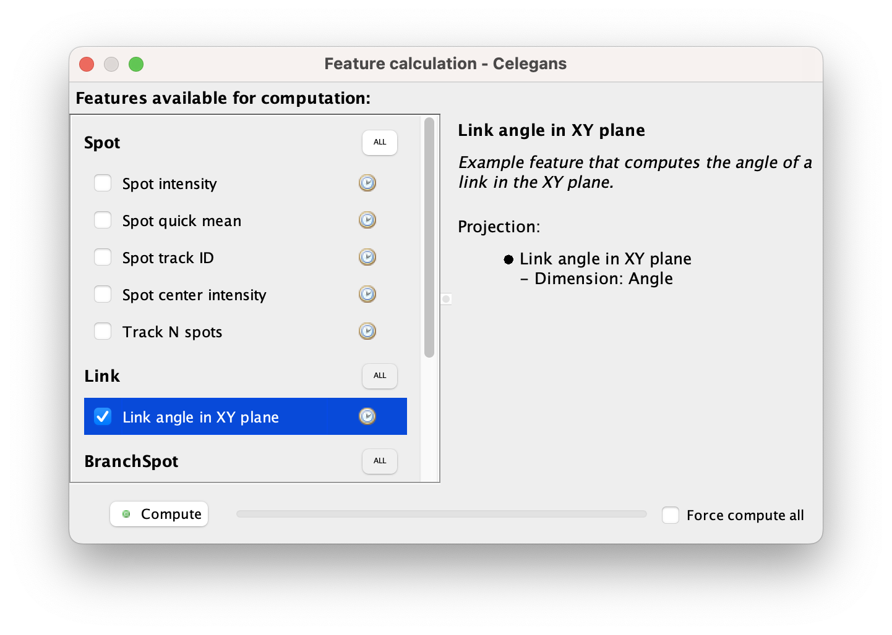
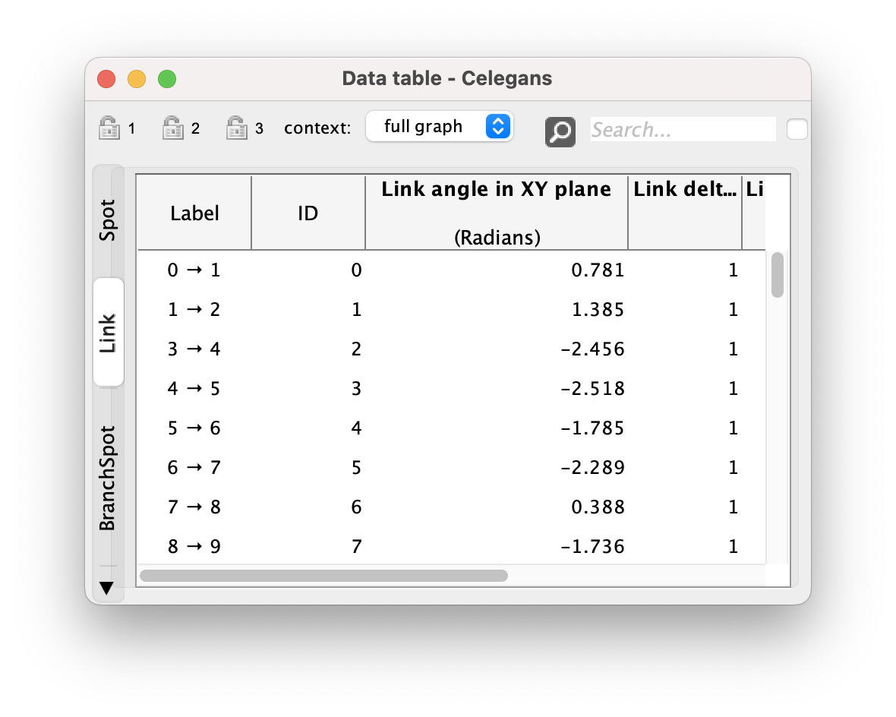
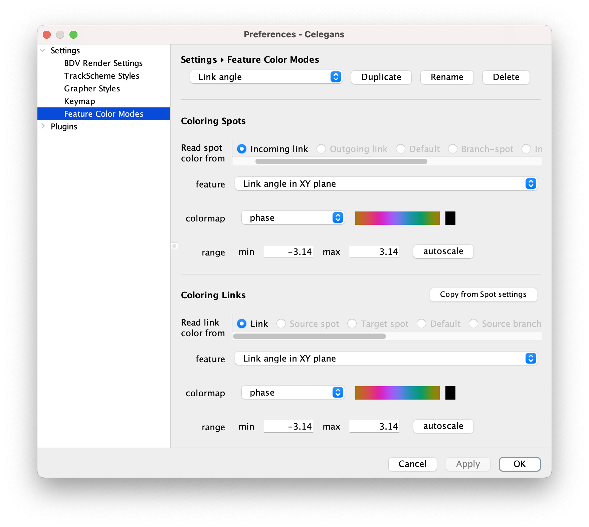
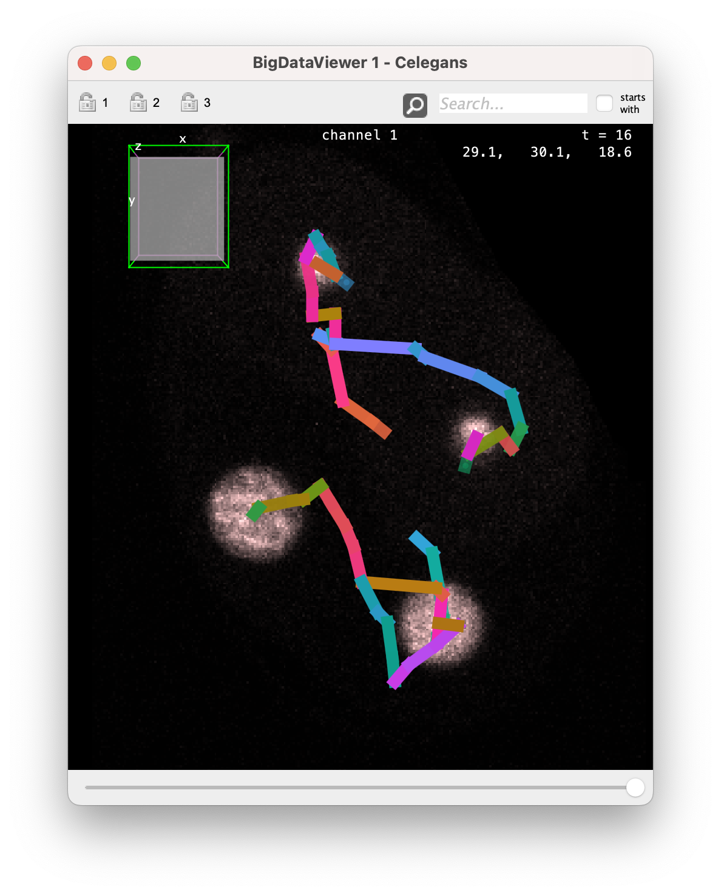

# Custom simple numerical features in Mastodon.

In this example we show an example of a simple custom numerical feature in  Mastodon. 
We take the simple example of returning the angle of a link in the XY plane.
The code corresponding to this part of the documentation is in the same repository as the previous tutorial, in the package:

> [https://github.com/mastodon-sc/mastodon-plugin-example/blob/main/src/main/java/org/mastodon/mamut/example/feature/](https://github.com/mastodon-sc/mastodon-plugin-example/blob/main/src/main/java/org/mastodon/mamut/example/feature/)

## The versatility and verbosity of the numerical feature system in Mastodon.

As an introduction, we would like to give some context about the feature system in Mastodon. This is unrelated to the programming tutorial, but maybe useful to understand the complexity we will deal with, and apologize a bit for it.
[TrackMate](https://imagej.net/plugins/trackmate/) and [MaMuT](https://imagej.net/plugins/mamut/index) - our previous works and the most similar  to Mastodon - were focused on tracking. 
But we already had recognized the utility of 'numerical features' for basic analysis and exploration, and the ability to extend analysis by creating and adding new ones to these platforms.
In TrackMate and MaMuT, the numerical feature system has some strong limitations: you can only have features that return a single real number for a data item (spot or link). 
In Mastodon we wanted to remove this limitation and have features returning any kind of objects, numbers, matrices or text.
We also wanted to avoid enforcing a specific implementation.
Finally, we wanted to have for Mastodon a reasonable approach when dealing with numerical feature for a very large number of data items. 
The price to pay for this generality is the length and verbosity of the code required to implement a feature. 
Now that we want to implement our own feature in Mastodon, we have to pay this price.

Somewhat fortunately, we also recognized this difficulty, and created a few facilities to accelerate feature development for certain cases.
For instance, in this example we want to develop a simple feature, that returns the angle of a link in a XY plane, giving the instantaneous direction of displacement for a cell. 
For this we simply need a feature that returns a scalar real number for each link. 
We don't even need to store them, and can compute it on the fly, avoiding the need to create a feature computer and storing the values it returns. 
We will start with this simple case, that allows for introducing the main concepts of the numerical feature system. 

Nonetheless, even our simple example requires two classes to be functional:
1. A class to store feature values and decompose it, the `Feature`,
2. And a class to compute the feature values, the `FeatureComputer`.
We will detail them one after the other.

## The feature class.

The starting point is the feature class [LinkXYAngleExampleFeature.java](https://github.com/mastodon-sc/mastodon-plugin-example/blob/main/src/main/java/org/mastodon/mamut/example/feature/LinkXYAngleExampleFeature.java) and we will start from there.
As for the plugin example this class is heavily commented but we repeat and extend these comments here. 

### The beginning.

A Mastodon feature is class that associates a value (numerical or  not) to a data item (a spot or a link). 
Such classes implement the [`org.mastodon.feature.Feature`](https://github.com/mastodon-sc/mastodon/blob/master/src/main/java/org/mastodon/feature/Feature.java) interface, with a type that specifies what data item they are defined for.
Because we want to compute something on links, our feature implements `Feature < Link >`.
We will see below the methods it specifies.
So the header of our feature class is:

```java
package org.mastodon.mamut.example.feature;

...
// All the imports.

public class LinkXYAngleExampleFeature implements Feature< Link >
{
```

We start by defining a few constants, that are used to declare the 'signature' or specifications of our feature: its name, what type of values it returns, what is their units and dimension, etc.

Our feature needs a name, and we will use it repeatedly. 
So we declare it now in a constant.
The feature name also serves as a unique key, hence the name of the constant. 
It is a good idea to use something meaningful to the users.

```java
	private static final String KEY = "Link angle in XY plane";
```

We also have a means to pass some information to the user about what a feature is, and we also store this in a constant.
```java
	public static final String INFO_STRING = "Example feature that computes "
			+ " the angle of a link in the XY plane.";
```

### The role of feature projections.

Before going on, we need to speak a little bit about the notion of _projections_.

Since a feature can return any type of data, we needed a way to make use of them in Mastodon in some specific situations, for instance to display feature values in a table, or use them in a color mode. 
For this we use *projections*. 
A feature can return a value of any type, but we ask it to be 'decomposable' into scalar, real projections. 
A feature projection returns a scalar real number for each data item, and a feature can be expressed as a collection of projections. 
What we see in the Mastodon tables and what we use in color modes are the projections. 
Of course, it is only useful for numerical features (number, matrices). 
Other feature types are specific enough to prompt for their own display. 
In the examples of this repository, we only deal with numerical features.

The way a numerical feature is decomposed into projection is completely up to you. 
The decomposition does not have to be complete, and it can be redundant.
For instance, here we will just compute the angle of a link in the XY plane, but in 3D it requires 2 scalar angles. 
In such a feature, you could use the polar angle and the azimuthal angle as projections. 
Or the x, y and z coordinates a unit vector along the link. 
Or even return the 2 angles and the 3 components. 
To choose the projections you need to think of the most direct way to use it in your track analysis pipeline.

In concrete implementations, we therefore need to give the specifications of the projections we will use, and pass these projection specifications to the feature specifications (read below). 
In our case we just have one, and projection specifications just need a projection name, and the dimension of the scalar value they return (in our case, an angle). 
This is done with the `FeatureProjectionSpec` class, as below. 
Our feature is made of one real value, so we use only one projection. 
For the projection name, we can reuse the feature name, since we have only one projection.
This part is then just:

```java
	public static final FeatureProjectionSpec PROJECTION_SPEC 
			= new FeatureProjectionSpec( KEY, Dimension.ANGLE );
```

The projection itself will be defined later in the code.

### Feature specifications.

In Mastodon, features are discovered and integrated via their specification class.
This specification is supposed to return basic information about the feature content, before it is computed.
Mastodon then uses it to sort features depending on what they do.

To be integrated into Mastodon, each feature must implement and return a specification class, that inherits from `FeatureSpec< F, O >` where `F` is the concrete feature class and `O` is the type of the data item the feature is defined for. 
This can be done as below, using an inner public static class.

And as for the example plugin we have seen, we rely on the SciJava plugin mechanism for automatic runtime discovery. 
Concretely this means you need to add the `@Plugin( type = FeatureSpec.class )` line above the class declaration for Mastodon to discover and integrate your class.

```java
	@Plugin( type = FeatureSpec.class )
	public static class Spec extends FeatureSpec< LinkXYAngleExampleFeature, Link >
	{
		public Spec()
		{
			super(
				KEY, // 1. The feature name.
				INFO_STRING, // 2. The feature info.
				LinkXYAngleExampleFeature.class, // 3. The feature class.
				Link.class, // 4. The class of the data item.
				Multiplicity.SINGLE, // 5. The multiplicity.
				PROJECTION_SPEC ); // 6... The list of projection specs.
		}
	}
```

The specification class itself just need to pass a few arguments via the super constructor. 
In order:

1. The name or key of the feature, which must be unique. 
By convention we choose user-friendly name, starting with the data item the feature is defined for, such as 'Link angle in XY plane'.

2. The information for users, as a String.

3. The class of the feature. In our case it will just be `LinkXYAngleExampleFeature.class`.

4. The class of the data item the feature is defined for. In our case, `Link.class`.

5. The multiplicity.
The multiplicity is an enum that specifies whether the feature is defined once or twice per channels in the image, or is independent from the the number of channels in the image.
For instance, for features the measure the mean intensity, we would use `Multiplicity.ON_SOURCES`, to signal that the feature needs to be
computed once per channel. 
In our case, the feature is independent from the image data and the number of channels it contains. 
For this we use the `Multiplicity.SINGLE` flag.

6. A series or list of feature projection spec, one per projection defined in the feature. 
Since we have a scalar feature, we will just put the one projection spec we created.

The next part of the code simply creates, stores and returns an instance of this feature specification class.

```java

	// Now we instantiate and keep and instance of this feature spec class.
	public static final Spec SPEC = new Spec();

	// And we return it in this method, specified by the 'Feature<>' interface.
	@Override
	public Spec getSpec()
	{
		return SPEC;
	}

```

### Implementing the feature projection.

Now we can code and instantiate the projection.
Here is the feature projection class. 
It implements `FeatureProjection< Link >` that specifies a bunch of methods related to getting a scalar  value for each link.
Because it is compact, we chose to put it in an inner class within the feature class.

In our case, since we do the computation on the fly, this is where the computation logic is. 

```java
	private static final class MyProjection implements FeatureProjection< Link >
	{

		/*
		 * This should return a key for 'projection'. We use a special class for
		 * this, used to facilitate manipulating a collection of projections
		 * elsewhere in Mastodon.
		 */
		@Override
		public FeatureProjectionKey getKey()
		{
			return FeatureProjectionKey.key( PROJECTION_SPEC );
		}

		/*
		 * This method below is used to indicate to Mastodon that a value exist
		 * for the specified data item, and *that this value is valid*. In our
		 * case, because we compute values on the fly, they always exist and are
		 * always valid.
		 */
		@Override
		public boolean isSet( final Link link )
		{
			return true; // Always set, always valid.
		}

		// The logic that computes the value.
		@Override
		public double value( final Link link )
		{
			// The source of the link (where it starts from).
			final Spot source = link.getSource();
			final double xs = source.getDoublePosition( 0 );
			final double ys = source.getDoublePosition( 1 );

			// Its target (where it points to).
			final Spot target = link.getTarget();
			final double xt = target.getDoublePosition( 0 );
			final double yt = target.getDoublePosition( 1 );

			final double dx = xt - xs;
			final double dy = yt - ys;

			return Math.atan2( dy, dx );
		}

		// The units.
		@Override
		public String units()
		{
			return Dimension.RADIANS_UNITS;
		}
	}
```

Back in the feature class, we need a field to store the instance:

```java
	/*
	 * This is the instance of the projection we will use to return the scalar
	 * real values. It is defined below and instantiated in the feature constructor.
	 */
	private final MyProjection projection;
```

And when we instantiate the projection in the feature class constructor:

```java
	public LinkXYAngleExampleFeature()
	{
		this.projection = new MyProjection();
	}
```

This is it for the computation. 
In our case it is very simple. 
It is somewhat daunting that such a simple computation requires that many
boilerplate code and specifications to be integrated in Mastodon. 
Again, the feature system ambitions to address a very wide range of situations and means of computations.
This generality is the source of this verbosity.

### Invalidating values.

The next method in the `Feature` interface is important for features that *store* values. 
These features have a 'computer' class that handles the computation logic. 
The computer class is called by the user (in the 'compute features' dialog), and when after it runs, the feature instance is created. 
The feature instance is then just used to store and return values.

But additionally, Mastodon has a mechanism to invalidate the values of the data items that are modified.
Let's take for example the feature that stores the mean intensity in a spot. 
If the user moves a spot to another position, or change its radius, the mean intensity value stored for this spot becomes invalid. 
When a user modifies a data item in such a way, Mastodon automatically calls the method below, which is meant to *discard* the value the feature stores.

For our example where the computation is done on the fly, we don't have to do anything.

```java
	@Override
	public void invalidate( final Link link )
	{}
```

### Returning projections.

The rest of the feature class is dedicated to returning the projections contained in the feature.

```java
	/*
	 * Here we should return the one projection we have if the specified
	 * projection key matches., or 'null' otherwise.
	 */
	@Override
	public FeatureProjection< Link > project( final FeatureProjectionKey key )
	{
		if ( projection.getKey().equals( key ) )
			return projection;

		return null;
	}

	/*
	 * Here we should return all the projections defined in the feature.
	 */
	@Override
	public Set< FeatureProjection< Link > > projections()
	{
		return Collections.singleton( projection );
	}
```

We could think our work is done.
Alas!
We still need to give Mastodon a  way to create the feature. 
And this is done in the feature computer. 
So the rest of the tutorial is in the `LinkXYAngleExampleFeatureComputer` class, and here you will see that it is the class that calls the constructor of this feature.

## The feature computer class.

We know describe the [`LinkXYAngleExampleFeatureComputer`](https://github.com/mastodon-sc/mastodon-plugin-example/blob/main/src/main/java/org/mastodon/mamut/example/feature/LinkXYAngleExampleFeatureComputer.java).

This class is part of the first tutorial on writing your own numerical feature for Mastodon. 
It discusses the computer logic, which will be very simple in our example. 

The separation of concerns in Mastodon is quite strong. In the previous class, we have seen the classes that are in charge of *storing* the values of a feature.
Though in our example it also contained the logic to compute these values, as we wanted to have a 'on the fly' feature.
Normally, the logic to compute a feature should be implemented in a feature computer. 
Such a class is the one discovered by Mastodon, and is in charge of creating the feature and adding values to it. 
It is normally the important one. 
This added verbosity and multiplication of classes gave us a wide berth as to how features are defined and calculated. 
But again, we pay the price now.

However this class will be quite brief.
Because for the XY angle the computation is done in the feature class, we just have to instantiate it.
To return the feature class to Mastodon, and receive the data required, a feature computer uses the SciJava modifiable private field, annotated with the `@Parameter` tag, that we will explain below. 
If you never met this technique before in Java, it will feel strange.

### The `MamutFeatureComputer` interface.

The feature computer class itself needs to implement the [`MamutFeatureComputer` ](https://github.com/mastodon-sc/mastodon/blob/master/src/main/java/org/mastodon/mamut/feature/MamutFeatureComputer.java) interface.
As for the plugin system, it has a `Mamut` in its name to indicate that it is specific to the cell lineaging application. 
And as for the plugin system, you need to annotate it by add the `@Plugin( type = MamutFeatureComputer.class )` line before the class declaration, so that Mastodon can discover the computer at runtime.

```java
@Plugin( type = MamutFeatureComputer.class )
public class LinkXYAngleExampleFeatureComputer implements MamutFeatureComputer
{
```

### Specifying the output and inputs of the computer.

Let's start immediately with the part that might feel new or strange or like dark magic. 
A feature computer is expected to receive a set of parameters, such as the image, the track data, etc., and return an output, the feature it computed.
But it does not have methods to do so.
Everything is done via annotated private field, annotated with a special tag.
This system comes from the SciJava core library, and is meant to simplify developing code that process things.

First, we will specify the output of this computer. 
This is the feature instance we will create.
It will be stored in a private field, and we add the `@Parameter` tag to signal Mastodon to look into this field. 
And we add the extra parameter `type = ItemIO.OUTPUT` to signal that this is the output that Mastodon should take after computation.

Thanks to SciJava, Mastodon will be able to read this field, even if it is private.
But very importantly: for this to work, the field must *not* be final.
If you get a stange error related to it, this is most of the time because of this.

```java
	@Parameter( type = ItemIO.OUTPUT )
	private LinkXYAngleExampleFeature feature;
```

Second, we can declare the inputs we need in the exact same way. 
Mastodon will inspect the class and automatically set the input fields you declared with the adequate values.
Of course, you have a limited choice in the list of fields you can add to your computer, but they should cover all cases.
Our simple example does not need anything, so there is nothing there.
The list of possible fields is documented elsewhere.

### The computer interface methods.

The `FeatureComputer` interface has only two methods.

```java

	/*
	 * In this method, the actual feature instance is typically instantiated,
	 * without any values.
	 */
	@Override
	public void createOutput()
	{
		feature = new LinkXYAngleExampleFeature();
	}

	/*
	 * This method is called after '#createOuput()'. This is where the
	 * computation logic should happen, storing the computed values in the
	 * feature instance. In our simple case, we have nothing to do.
	 */
	@Override
	public void run()
	{}
```

That's it!
With this, a new feature should appear in the feature computation dialog.
If you check it and trigger a computation, the new feature will appear and be usable throughout Mastodon.

## The results. 

If you compile this repository and drop it in Fiji, the feature should automatically appear in Mastodon.
First in the feature computation dialog:

{align="center" width="500"}

And after clicking on the `compute` button, the values will be listed in the data table:

{align="center" width="500"}

The feature values can be used in a color mode to follow cell motion direction over time.

{align="center" width="600"}

And in the `C.elegans` dataset, it looks like this:

{align="center" width="500"}

Because in this case the values are computed on the fly, the resulting link color will be updated live when you move a spot around, as examplified in the video below.

{align="center" width="500"}